# Portal: The Complete Beginner's Guide

This guide takes you from your first sign-in to everyday work with assistants, files, background tasks, and scheduled delegations. You do not need to know Python, Git, Docker, or Kubernetes to use an already deployed Portal.

**Audience:** members and administrators of Engineering Flow Platform Portal. If you need to install Portal, begin with the [Operations Guide](OPERATIONS_GUIDE.md), then return here.

**Version:** reviewed against GitHub `master` commit `021baaafdc3f2406540b467596c6ba961ad821d5` on September 17, 2026. Buttons and available capabilities can vary with your account, enabled engine, runtime version, and administrator's settings.

**About the screenshots:** these are actual captures of that Portal revision running locally with a separate demonstration database and a fictional `guide-admin` account. No real service credentials, Kubernetes runtime, model response, or browser bridge were used. The pictures demonstrate the interface and setup forms; a `Running` label in this local mode is not proof of a working AI connection. Runtime-dependent steps below describe what to do on a configured deployment. See [screenshot provenance](screenshots/README.md).

## Contents

1. [What Portal does](#1-what-portal-does)
2. [Before you begin](#2-before-you-begin)
3. [Sign in](#3-sign-in)
4. [Find your way around](#4-find-your-way-around)
5. [Create your first assistant](#5-create-your-first-assistant)
6. [Set up Connections](#6-set-up-connections)
7. [Have your first conversation](#7-have-your-first-conversation)
8. [Use skills and run settings](#8-use-skills-and-run-settings)
9. [Manage sessions and context](#9-manage-sessions-and-context)
10. [Work with files](#10-work-with-files)
11. [Manage an assistant](#11-manage-an-assistant)
12. [Create and follow background tasks](#12-create-and-follow-background-tasks)
13. [Set up delegations](#13-set-up-delegations)
14. [Connect your local browser](#14-connect-your-local-browser)
15. [Administration](#15-administration)
16. [Help, shortcuts, and smaller screens](#16-help-shortcuts-and-smaller-screens)
17. [Troubleshooting](#17-troubleshooting)
18. [Practice workflow and completion checklist](#18-practice-workflow-and-completion-checklist)
19. [Glossary and further reading](#19-glossary-and-further-reading)

## 1. What Portal does

Portal is the web application where you create assistants and ask them to do engineering work. An assistant's **runtime** is the service that actually runs its model, tools, and skills. Portal manages access, configuration, tasks, and the interface that connects you to that runtime.

| Term | Plain-English meaning | Example |
| --- | --- | --- |
| Assistant | A workspace with its own conversations, files, and configuration | Your personal Dev Assistant |
| Assistant type | An administrator's preset for a kind of work | Business, Dev, or Ops Assistant |
| Chat/session | One conversation within an assistant | Investigating one bug |
| Connections/profile | Your service settings and credentials, reusable by several assistants | Your GitHub and Jira access |
| Skill | A packaged procedure the runtime knows how to execute | A repository review workflow |
| Task | Background work that has a tracked status and result | A review you return to later |
| Delegation | A rule that creates tasks from matching events or a schedule | Review requests or a weekday report |
| Connector | A connection to a user-side capability | The EFP browser window on your computer |

Start with your own assistant. A shared assistant can be visible to you without giving you permission to manage it. Tasks and delegations are visible across signed-in members in this revision; their owners control management actions. **Mine** filters to your items, while **All** includes other members' visible work. Do not assume that a task's input or result is private just because you created it.

## 2. Before you begin

Ask your administrator for:

- The Portal web address and the approved sign-in method.
- Confirmation that your sign-in username is on the active allowlist.
- Which assistant type to choose and which model connection your team uses.
- The services you need and any organization-specific token instructions.

Use a current desktop browser for the first walkthrough. Keep your service credentials available, but enter them only into their connection fields. You can start with just the model connection and add Jira, GitHub, and other services when a task needs them.

If you installed Portal locally with `K8S_ENABLED=false`, you can explore these screens, but creating an assistant does not start a real runtime. Follow the [real-runtime setup](OPERATIONS_GUIDE.md) before expecting chat, skills, files, or background execution to work.

## 3. Sign in

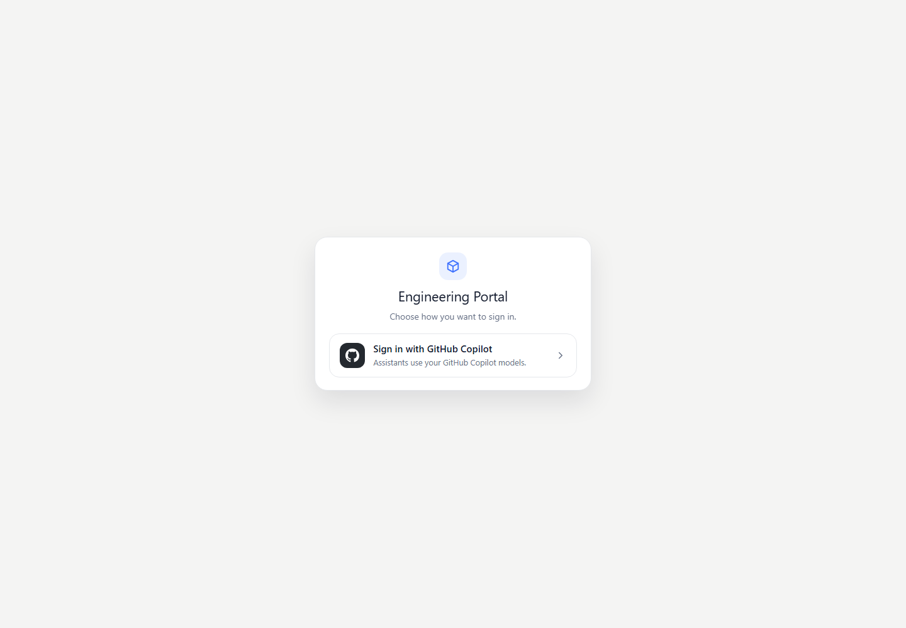

*Figure 1. The local example has GitHub Copilot sign-in enabled. Your organization may show SSO instead, or alongside it.*

1. Open the Portal address in your browser. You will reach the sign-in page if you do not have a session.
2. Choose the method your administrator gave you:
   - **SSO:** follow the organization's identity-provider sign-in and return to Portal.
   - **GitHub Copilot:** follow the displayed GitHub authorization steps. If an enterprise SSO step appears, complete it first. Copy the device code, open the authorization page, authorize your account, then return to Portal and wait for completion.
   - **Username and password:** use the supplied credentials if this form is offered. Administrators can use `/admlogin` for the bootstrap account even when normal login uses external sign-in.
3. If Portal says you are not on the allowlist, send the administrator the username shown. Signing in repeatedly will not grant access.
4. On your first visit, the welcome tour explains assistants, tasks, and delegations. Use **Next** to proceed, or **Skip** to explore first.

**There is no self-service registration form.** Eligible external accounts are provisioned during their first successful sign-in. An allowlist entry grants eligibility; it does not create a password account. Portal access and permission to use a model are separate checks, even though Copilot sign-in can also populate your default model credentials.

## 4. Find your way around

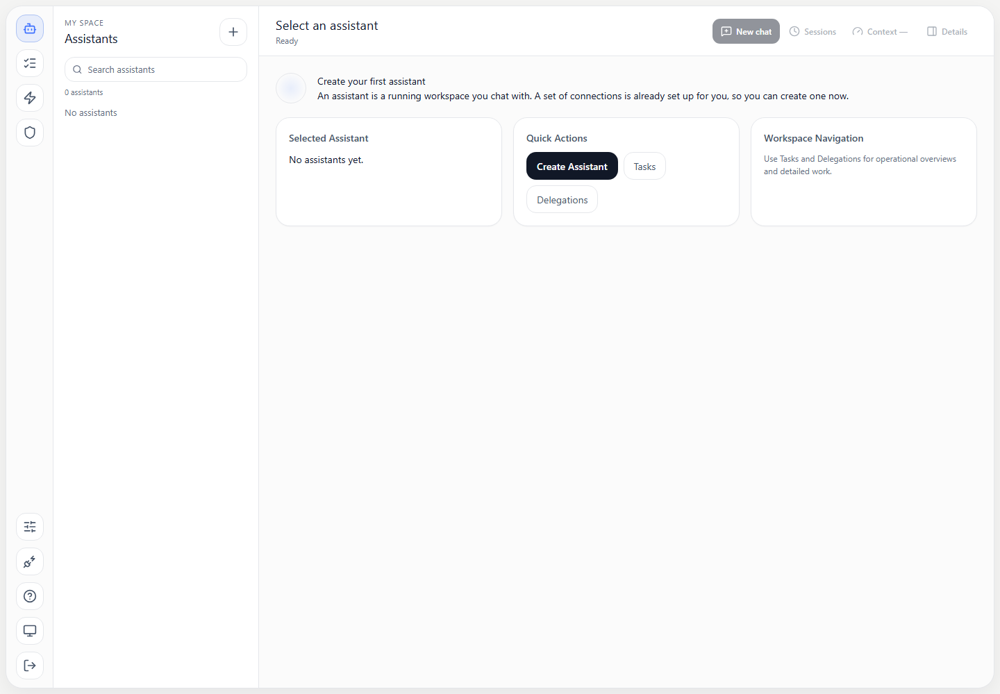

*Figure 2. A new workspace before an assistant has been created.*

The narrow rail on the far left switches sections. Hover over an icon to see its name.

| Section/control | What you do there |
| --- | --- |
| Assistants | Find, create, and open assistants |
| Tasks | Start background work and inspect results |
| Delegations | Configure recurring or event-driven work |
| Administration | Manage members, assistant types, and defaults; admins only |
| Connections | Configure your service credentials and profiles |
| Connectors | Set up capabilities such as your local browser; if enabled |
| Help | Read topic-based instructions and keyboard shortcuts |
| Theme | Switch the appearance |
| Logout | End your Portal session |

The next column contains the list for the selected section. Its **+** button creates an item where supported. The large central area shows the conversation or selected detail. Top-bar buttons change with the section.

Assistant utilities open in a panel on the right. Close it with **Close panel** before switching sections if it covers the workspace. On a sufficiently wide screen you can pin the panel and resize it. You can also bookmark the page address after opening a particular assistant, task, delegation, or help topic; access checks still apply when reopening it.

## 5. Create your first assistant

### Simple setup

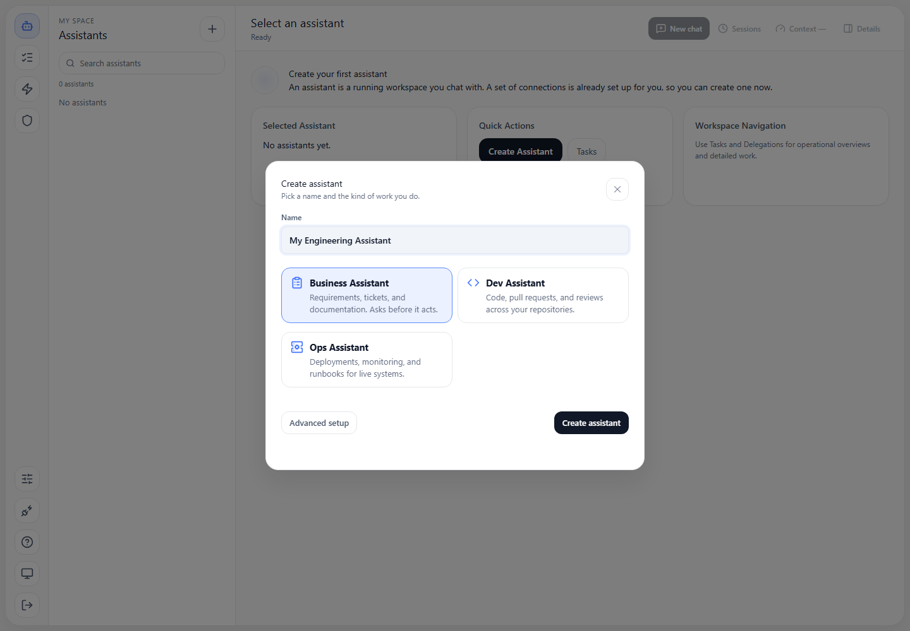

*Figure 3. Simple setup needs a name and an assistant type.*

1. Open **Assistants**.
2. Click **+** or **Create Assistant**.
3. Enter a useful name, such as `My Engineering Assistant`.
4. Select the type that matches your work. The initial presets include **Business Assistant**, **Dev Assistant**, and **Ops Assistant**; your administrator can change them.
5. Click **Create assistant** once and wait for the result.
6. Select the new assistant in the list. Follow any startup banner or connection guidance.
7. Open **Connections** and complete your model authorization as described next.

The type chooses the engine and behavior/skill branches; your own default connection profile supplies your credentials. Creating an assistant does not give it access to services you have not connected.

**Success check:** the assistant appears in your list and, on a deployed system, finishes starting. A successful short reply in [section 7](#7-have-your-first-conversation) is the practical end-to-end check.

If no types are offered, ask an administrator to enable a type backed by an engine the deployment offers. Do not guess repository branches to bypass a missing preset.

### Advanced setup

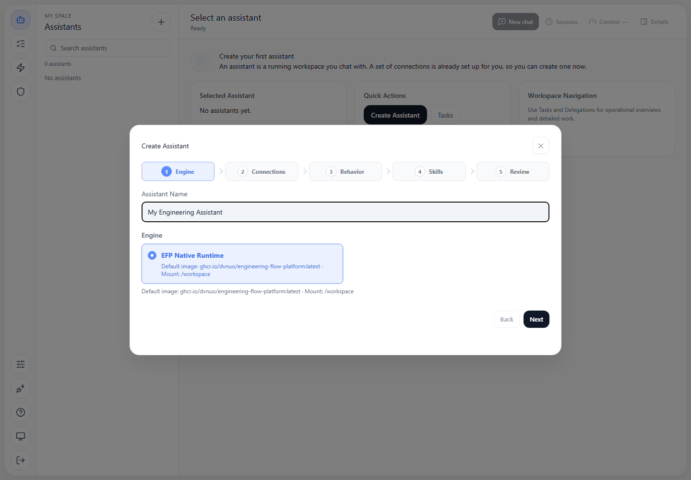

*Figure 4. Advanced setup exposes the configuration behind a preset.*

Use **Advanced setup** only when you need a specific configuration:

1. **Engine:** enter the name and select an offered engine. Portal supports native EFP and OpenCode, but administrators may enable only one. The deployment supplies the runtime image; this form does not ask you to choose it.
2. **Connections:** select the profile this assistant should use. A default profile is normally already available.
3. **Behavior:** choose the approved behavior repository/branch settings exposed by the form. These control the assistant's instructions and may provide its greeting and starter cards.
4. **Skills:** choose the approved skills repository and branch. These supply reusable procedures; they are not your business repository checkout.
5. **Review:** check the summary, then create the assistant.

Use **Back** to correct a choice. Repository access or branch-list failures usually need administrator attention. Business repositories mentioned in your requests are checked out by the runtime when needed; selecting a skills repository does not automatically check out a project to work on.

## 6. Set up Connections

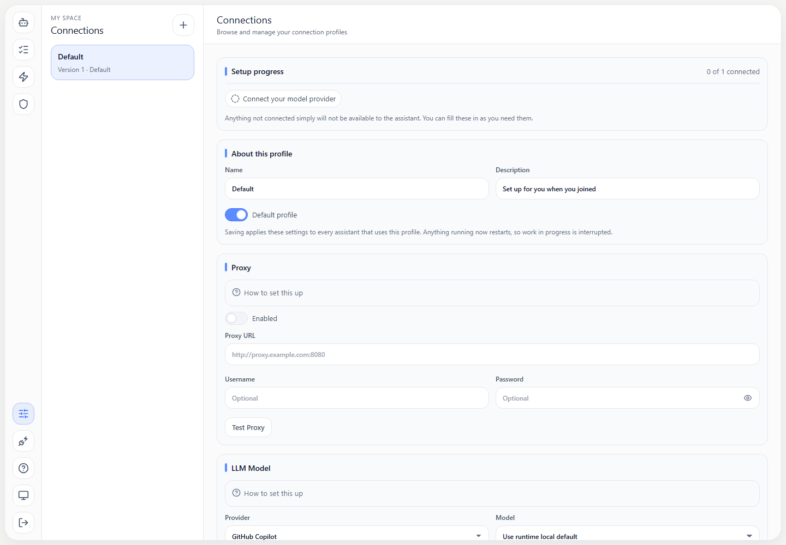

*Figure 5. A connection profile can be used by several of your assistants.*

1. Click **Connections** on the left rail.
2. Select your profile. A personal default is created for you.
3. Review **Setup progress**. Click a service name to jump to its fields.
4. Fill in only the services your work needs. Expand **How to set this up** beside a section for its specific instructions.
5. Use the available **Test** control for that service. Read the result before proceeding.
6. Click **Save Settings** at the bottom of the form. A successful test does not replace saving the form.

**Before saving:** check how many assistants use this profile. Saving synchronizes their settings and can restart all running assistants bound to it, interrupting their work. Finish or stop important work first and read the confirmation.

Setup progress reflects configuration readiness; it is not a continuous health check of every remote service. A token may be present but expired or missing permissions.

### Model connection

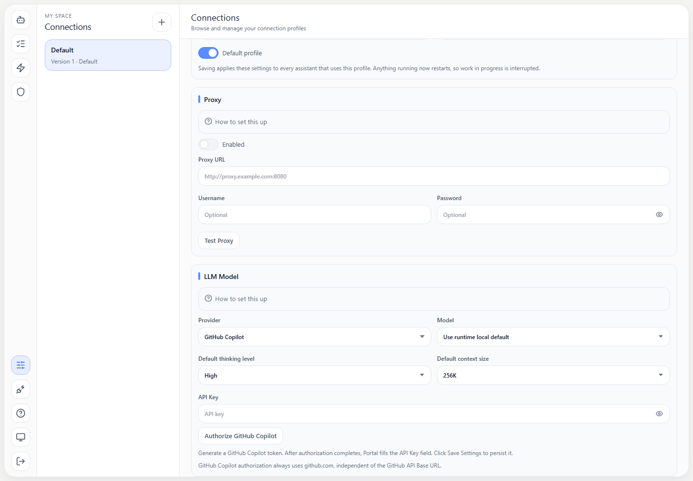

*Figure 6. Complete the model connection before expecting an assistant to answer.*

The current Portal supports **GitHub Copilot** and **AI Platform** configurations. Choose from the options offered by your deployment; old instructions mentioning arbitrary OpenAI or Anthropic API-key setup do not describe this revision.

- **GitHub Copilot:** start the authorization flow in the profile, follow its device-code instructions on GitHub, return to Portal, and wait for the authorized state. If your Portal sign-in already supplied the authorization, inspect its current state before reconnecting.
- **AI Platform:** enter the username, password, and **Usercase** provided by your organization. Service endpoints and transport settings are managed centrally.
- Choose an available model. Use the profile's normal defaults at first; per-run overrides are explained in [section 8](#8-use-skills-and-run-settings).

If authorization fails immediately, check the account's model entitlement and connection details. A working Portal login alone does not prove the model can answer.

### Service-by-service checklist

| Connection | What to enter or check | How to confirm it works |
| --- | --- | --- |
| Jira | Instance name and URL, enabled state, account username/email, password or API token as required, optional project, and API version | Use **Test Jira**, then ask for one issue your account can read |
| Confluence | Instance name and URL, enabled state, username/email, password or API token as required, and optional space | Use **Test Confluence**, then ask for one accessible page |
| GitHub | Correct API host and a token authorized for the intended repositories/actions | Use **Test GitHub**, then read a known repository |
| Jenkins | Correct instance URL and the supported username/password or token fields | Ask for a known job/build using a runtime skill that supports it |
| BrowserStack Mobile | BrowserStack username and access key | Try the relevant mobile workflow after the runtime/skill is available |
| AWS | The domain, username, and password expected by your organization's integration | Use the approved AWS workflow and verify its target account |
| Proxy | Enable it only when required; use your administrator's proxy URL | Retest a service that must use it |
| Git | Your commit author name and email | Inspect the author of a subsequent test commit; these fields are not authentication |
| Debug | Enabled state and log level, usually left at normal defaults | Change only while diagnosing a specific problem |

Jira, Confluence, and Jenkins can have multiple instances. Use **+ Add Jira Instance**, **+ Add Confluence Instance**, or **+ Add Jenkins Instance** to add one; give it a clear name, enter its URL and applicable credentials, and enable both the service section and the intended instance. **Remove** deletes an instance from the form when saved; disabling it retains its settings. Use instance names in your requests when more than one target is configured.

Your profile is an editable copy of its starting settings. The administrator's default setup can include shared service-account credentials; it is not a live policy that locks your service URLs. AI Platform endpoints are the exception: they are supplied by deployment configuration. Check the approved URL with your administrator before changing an unfamiliar endpoint.

For external tokens, follow your organization's current scope and authorization instructions. Grant the repositories and actions you actually need. Copilot model authorization and a GitHub repository token serve different purposes; connecting one does not automatically configure the other.

**Important:** a connection makes credentials available; actual tool availability still depends on the engine, runtime version, installed skills, and runtime permission policy. For example, a Jenkins connection is not a promise that the installed workflow can start builds.

### More than one profile

Use the **+** in Connections to create another profile when you need a different set of service settings. Give it a recognizable name, inspect the **Start this profile with** source, and optionally set it as your default. **The setup your admin prepared** copies the current platform defaults when available; **Nothing - I'll set it up myself** starts empty; **A copy of ...** duplicates one of your profiles, including saved sign-in details. Copies are independent: later changes to the source do not update them.

Select the intended profile in an assistant's advanced create/edit flow. Changing the default selects what future assistants use; it does not mean every existing assistant was rebound. Inspect each assistant's binding. A profile that is still bound to assistants cannot be deleted; move those assistants to another profile first. You also cannot delete your last profile. Deleting an unused default profile promotes one of your remaining profiles to default.

## 7. Have your first conversation

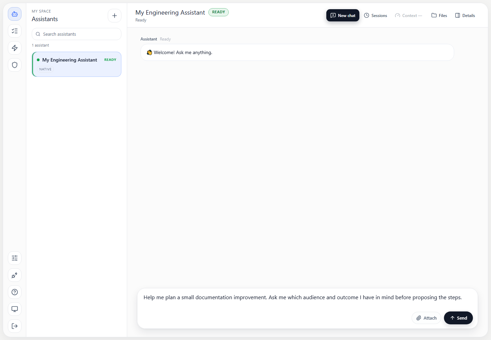

*Figure 7. The real chat layout. This local screenshot has no connected runtime; it does not show a successful model response.*

1. Select your assistant and wait for its startup status to settle.
2. Click the message box.
3. Try a request that does not depend on an external service:

   > Help me plan a small documentation improvement. Ask me which audience and outcome I have in mind before proposing the steps.

4. Press **Enter** or click **Send**. Use **Shift + Enter** for a new line.
5. Read the response. Answer any follow-up question in the question card or message box as appropriate.

**Success check:** a reply arrives and remains in the conversation. If it fails with a connection error, fix the model/runtime connection before testing Jira, GitHub, or other integrations.

### Give useful instructions

Describe the outcome, relevant source, constraints, and expected output:

> Read issue DEMO-123 from our Jira connection. Summarize the problem, list missing acceptance criteria, and draft three test scenarios. Show me the draft before posting anything to Jira.

Replace example identifiers with real resources you are authorized to use. Include the repository URL and branch when asking for code work. Specify whether you want an explanation, a draft, a file, or an external change.

### While work is running

- The conversation may show progress, tool activity, expandable details, and a final response. A tool step is not necessarily the final answer.
- Use **Stop run** to interrupt the current run. Stopping does not undo changes a tool has already made.
- If the assistant asks a question, choose an offered option or supply the requested text, then submit it once.
- If a permission or approval card appears, inspect the proposed action and target before approving or rejecting it. Which actions prompt depends on the runtime's policy and assistant behavior; do not assume every external write always prompts.
- Reopen the same assistant/session to recover pending questions when supported by the runtime.

Some behavior packs show **starter cards** below the greeting. Clicking a card starts its workflow; if it needs a ticket or other value, it asks for that first. Read the card before clicking it.

### Read, copy, and revise answers

Assistant messages support formatted text, code blocks, tables, diagrams, and file links. Use **Copy** on a message or code block. Mermaid diagrams offer **Diagram** and **Code** views; copy their source if you want to reuse it in documentation, and open the larger diagram view when offered. Open file previews when available; output depends on what the runtime returned.

Use **Edit message** on your earlier prompt if you need to change the instruction. Use **Retry** on an assistant response to regenerate it. These operations can remove or replace later conversation history: read the confirmation, and copy anything you want to keep first. Deleting a conversation branch does not revert external commits, comments, or other side effects.

## 8. Use skills and run settings

A skill is a named workflow installed in the runtime. Available skills are loaded from the selected assistant, so two assistants can show different lists.

1. Click the message box and type `/` to open the skill suggestions. Continue typing part of a skill name to narrow the choices.
2. Select the appropriate skill from the suggestions. The composer shows the selection as a chip.
3. Supply the instruction or required inputs. Selecting a skill alone does not explain which repository, issue, or outcome you want.
4. Remove or change the chip if you selected the wrong skill, then send the request.

If the skill list is empty or unavailable, confirm the runtime is reachable and its configured skills repository/branch was provisioned successfully. Portal displays the runtime's inventory; it does not execute the skill itself.

The composer's **Run settings** controls can expose **Model**, **Thinking level**, and **Context size**. Task and delegation wizards also offer run settings. Start with **Agent default** and **Automatic**. Only choose values actually offered for the selected model; unsupported combinations may be rejected. Larger context or more thinking can take longer and use more provider capacity.

## 9. Manage sessions and context

An assistant can hold more than one conversation. Use a separate session for a new topic so unrelated history does not crowd the model's context.

| Action | Steps and expected effect |
| --- | --- |
| Start fresh | Click **New chat**. You get a fresh conversation in the same assistant; its profile and workspace remain |
| Resume a conversation | Click **Sessions**, find the relevant conversation, and open it |
| Recognize an earlier conversation | Inspect the title and preview in **Recent Sessions**; the current panel shows a recent list and has no dedicated search or pagination controls |
| Rename a session | Use its pencil button (**Rename session**), enter a clear title, and confirm; available to the owner or an administrator |
| Remove a session | Use the session's delete control and confirm. Save needed content first; deleting history does not delete every workspace file or undo external work |
| Inspect context | Open **Context** after a session exists. Read the reported usage; an unavailable value is not zero usage |
| Compact context | Click **Compact conversation** when supported, read the confirmation, and wait for completion. It replaces older visible turns with a summary; native sessions create a recovery checkpoint first |

Context is the material the model can consider for the current conversation, not the disk capacity of your workspace. The Context panel reports approximate token usage, the model, and a coarse category breakdown. Compaction and history operations depend on runtime capabilities; editing, retrying, renaming, deleting, and compacting require the owner or an administrator. Finish or stop a current run before changing that conversation's history. Use a new chat when you want a clean topic; use compaction when you want to continue a long topic with a shorter working context.

If you navigate away during a reply, reopen the same session and inspect its state before resending. Resending an instruction can repeat an external action.

## 10. Work with files

There are two different file workflows:

| Workflow | Use it for | Steps |
| --- | --- | --- |
| Chat attachments | A document, image, or other input for your next message | Click **Attach**, choose the file, wait for upload to finish, then send a message explaining what to do with it |
| Server files | Files in the assistant's runtime workspace | Click **Files**, browse folders, preview supported files, and use upload/download controls |

You can also drag files into the supported chat drop area. Paste images when your browser and the composer support it. Remove the attachment chip before sending if you selected the wrong input.

**Wait for upload completion.** A selected local filename does not mean the runtime has received the file. The default Portal upload limit is 25 MB, but the runtime and ingress can impose a lower effective limit. Ask an administrator about a consistent upload-limit change instead of repeatedly retrying an oversized file.

In **Files**, select the desired items before clicking **Download** or **Delete**. Deletion requires confirmation and is not reversible through Portal. File links returned in chat can open previews or workspace files; an unsupported file format may need downloading for a local application.

The **Files** panel, including read/download operations, is available only to the assistant's owner or an administrator. It is not granted by sharing an assistant. Browse into the destination folder before uploading a workspace file, and use folder navigation to return to its parent. Downloading selected folders or several items can return an archive.

Chat history, uploaded attachments, and the persistent workspace have different lifecycles. Starting a new chat does not wipe the workspace. Deleting an assistant currently leaves its shared-volume workspace files on the cluster; contact the administrator for retention or recovery. This is not a replacement for a backup.

## 11. Manage an assistant

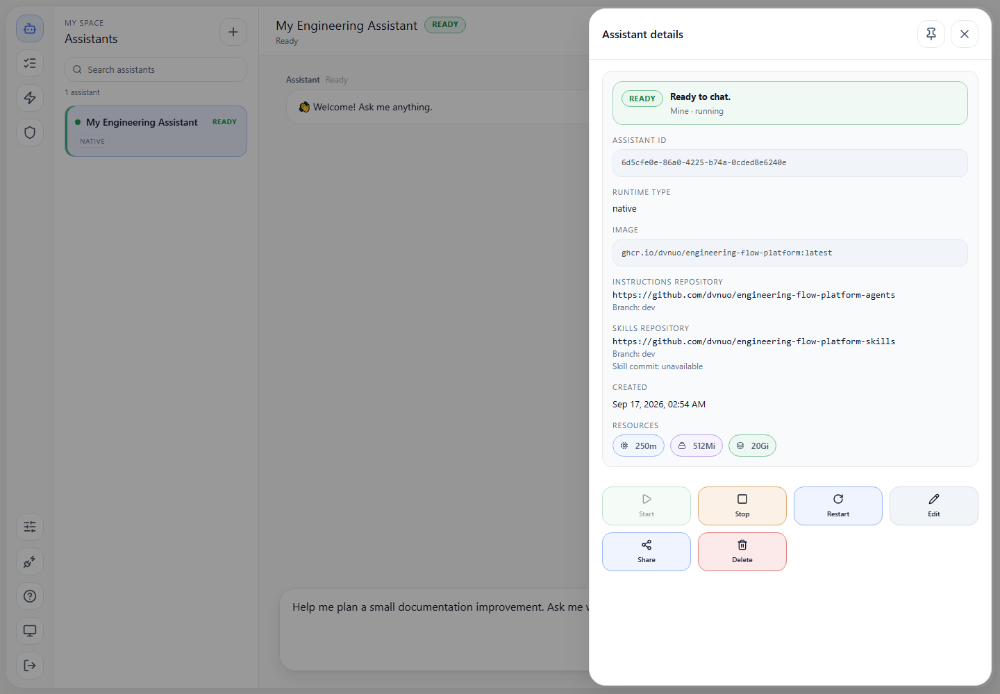

*Figure 8. Details groups the selected assistant's controls and configuration.*

Select an assistant, then click **Details**.

| Control | When to use it | What to expect |
| --- | --- | --- |
| Start | The assistant is stopped or failed and the underlying problem is fixed | Provision/start its runtime and wait for readiness |
| Stop | You want to release its running resources | Current work can be interrupted; persistent workspace data is retained |
| Restart | Configuration changed or a running runtime needs restarting | Current work can be interrupted; wait for startup again |
| Edit | Change supported name, engine, profile, behavior, or skill settings | Review the wizard and any restart implications before saving |
| Share / Unshare | Make an assistant visible to other Portal members or private again | Visibility does not grant another member ownership or write access |
| Delete | Remove an assistant you no longer need | Removes its Portal record/runtime resources; shared workspace files are retained on the cluster |

Only the owner or an administrator can modify an assistant. Some actions are disabled because its current state does not allow them. A shared assistant can be read-only.

The details panel also shows runtime/repository information and, when available, usage. **No usage data** means metrics were unavailable; it does not prove that no work or cost occurred. Portal can stop long-idle assistants automatically according to deployment settings; start yours again when you need it.

### System instructions

The **System Prompt** area in Details exposes the instruction sections the runtime reports. Section names, editability, and enabled toggles vary by engine and runtime. Read the current content before editing, change only a section that is offered as editable, then save and follow any runtime feedback. Some sections cannot be disabled. A new chat is useful for checking changed instructions without an unrelated prior conversation.

Do not put service tokens into system instructions. Use Connections for credentials.

## 12. Create and follow background tasks

Use a task when you want work to be tracked independently of an interactive chat.

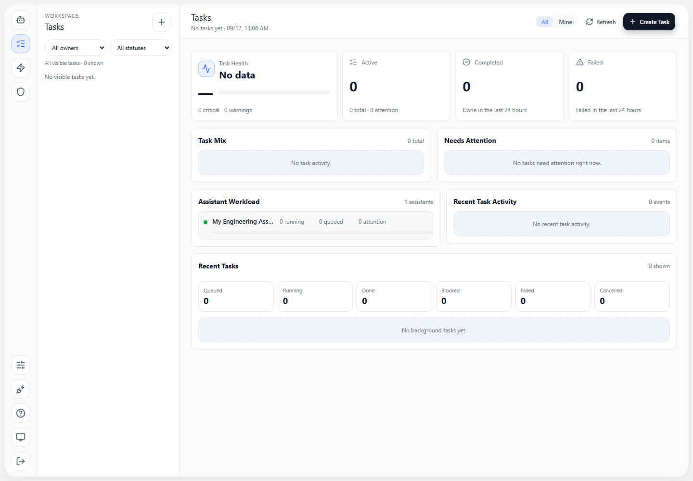

*Figure 9. Tasks has an overview plus an individual task list.*

### Create a task

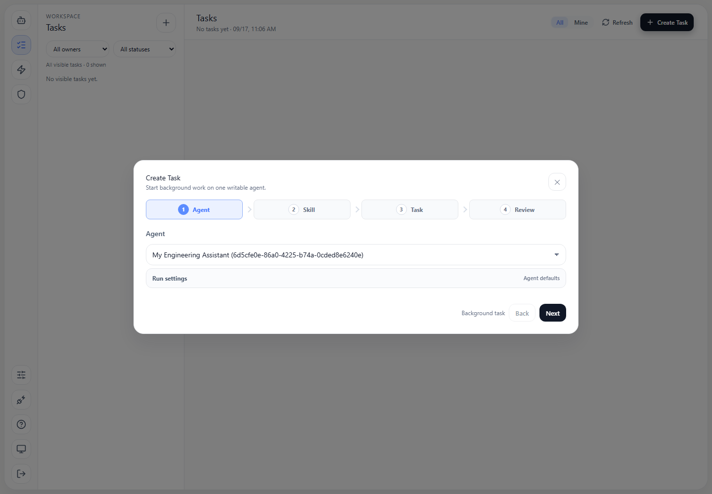

*Figure 10. The task wizard proceeds through Agent, Skill, Task, and Review.*

1. Open **Tasks** and click **Create Task** or **+**.
2. **Agent:** choose an assistant you can operate. Leave **Run settings** at its defaults unless the task requires an override.
3. **Skill:** choose an available skill. If this step cannot load, fix the assistant/runtime connection first.
4. **Task:** describe the objective, input sources, constraints, and completion criteria. For example:

   > Review the documentation in the specified repository and branch. Identify setup steps that a first-time user cannot follow. Produce a report with file paths and suggested corrections. Do not publish changes.

5. **Review:** check the selected assistant, skill, and text.
6. Click **Start Task** once. Open the resulting task to follow its status.

The local screenshot stops at the form; it does not demonstrate a successful task run. On a deployed system, the target assistant must have a working runtime, model connection, installed skill, and any required service permissions.

### Read the status and result

Filter the sidebar by owner and status. Use **Mine** for your own work, **All** for work visible to your account, and **Refresh** to update an overview.

| Status | Meaning and next step |
| --- | --- |
| Queued | Accepted and waiting to start |
| Running | The task is executing; open its details for progress |
| Blocked | It needs attention or cannot proceed; read its reason |
| Done | Execution completed; read the result and verify the outcome |
| Failed | Execution failed; fix the reported cause before retrying |
| Stale | Work was superseded or its runtime state could not be reconciled; inspect the explanation |
| Cancelled | Execution was cancelled |
| Pending restart | The runtime says a restart is required before this work can complete; inspect its explanation and coordinate the assistant restart |
| Cancel failed | Cancellation did not complete successfully; verify whether the runtime is still working |

Task details can include the summary, errors, execution history, input, and a **Download JSON** result. Do not treat **Done** as a substitute for reviewing a generated artifact or external change.

### Continue, rerun, or cancel

- **Add Follow-up:** opens the **Continue Task** wizard. Add the next instruction to the same task session, review it, and submit.
- **Rerun:** run the stored input again in a fresh runtime session. Check whether the earlier attempt already produced an external change before repeating it.
- **Cancel:** stop a cancellable queued/running task. Wait for the resulting status; a click is not proof of a successful cancellation.

Only the task's owner can use these management actions, including when another viewer is an administrator. Cancel is available for queued/running tasks. Follow-up and rerun require a finished attempt and no active attempt in the task chain. Both reuse the current Portal task record and clear its previous result while the next run executes, so download or copy a result you need to retain first. A follow-up keeps the runtime session; a rerun starts a new one. **Task Chain** appears only when linked task records exist; it is not a guaranteed archive of every rerun. Active task details refresh automatically.

## 13. Set up delegations

A delegation is an automation rule. It selects a source, an assistant, and a skill; matching work becomes tasks you can inspect later.

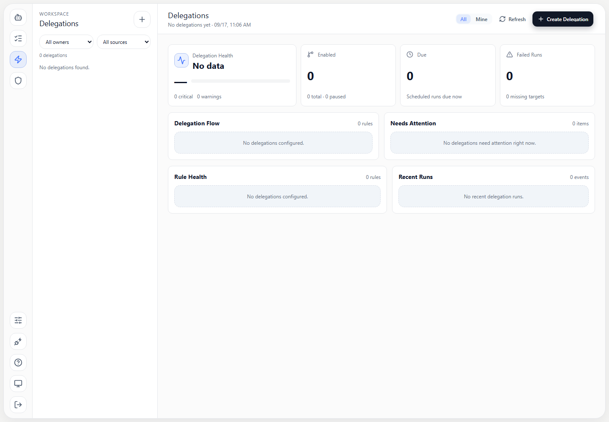

*Figure 11. The overview shows delegation rules, not the chat history.*

### Choose the source

| Source | What starts the work | What to configure |
| --- | --- | --- |
| GitHub PR Review | A review request for the connected GitHub account | GitHub connection and repository/PR conditions |
| GitHub PR Mention | A matching mention of the connected GitHub account | GitHub connection and repository/PR conditions |
| Jira Assignee | Work assigned to the connected Jira account | Jira instance and issue conditions |
| Jira Mention | A matching mention of the connected Jira account | Jira instance and issue conditions |
| Timer | A cron schedule | Task prompt, timezone, schedule, and overlap policy |

Event-driven sources are checked by Portal's worker at the configured interval. They are not a promise of instantaneous webhook delivery. The assistant's connection profile provides the source account and credentials.

For GitHub sources, **Repository** uses `owner/repo`; optional **Base branch**, included/excluded labels, and **More conditions** narrow the match. More conditions contains PR authors, excluded authors, and **Include draft PRs**. For Jira, choose the **Jira instance** and optionally a project key, issue type, included/excluded statuses, then priority and labels under **More conditions**. Multi-value fields accept comma-separated values. Leave a filter blank only when you intend no restriction from that filter; the preview summarizes an unrestricted rule as **Everything this connection can see**.

### Create a rule

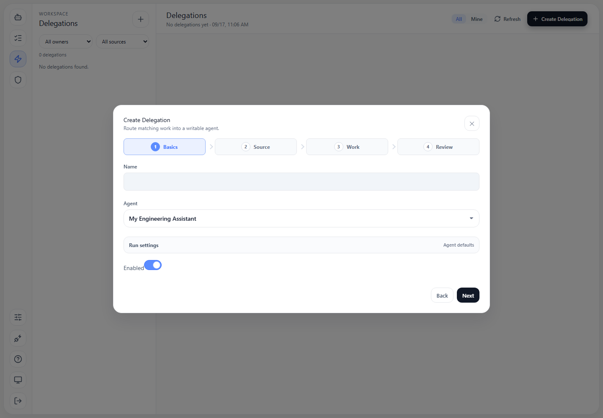

*Figure 12. Configure Basics, Source, Work, and Review before enabling automation.*

1. Click **Create Delegation**.
2. **Basics:** give it a descriptive name, choose the target assistant, inspect run settings, and choose whether it should be enabled. Leave it disabled while you are still preparing it.
3. **Source:** select the event type or Timer. Fill in the service instance, scope, and conditions that appear. Resolve any **Needs source** warning.
4. **Work:** choose the skill. For an event source, set the polling interval. For Timer, enter the task prompt, cron expression, timezone, and overlap preference.
5. **Review:** check the whole rule, including the account it will act as and its enabled state.
6. Create the rule, open its details, and inspect its source readiness and schedule.

### A first timer example

For a weekday report at 9:00 AM Shanghai time, use:

```text
Name: Weekday documentation check
Source: Timer
Cron expression: 0 9 * * 1-5
Timezone: Asia/Shanghai
Skip overlapping runs: enabled
Task prompt: Inspect the approved documentation source and report new issues.
             Produce a summary only; do not publish changes.
```

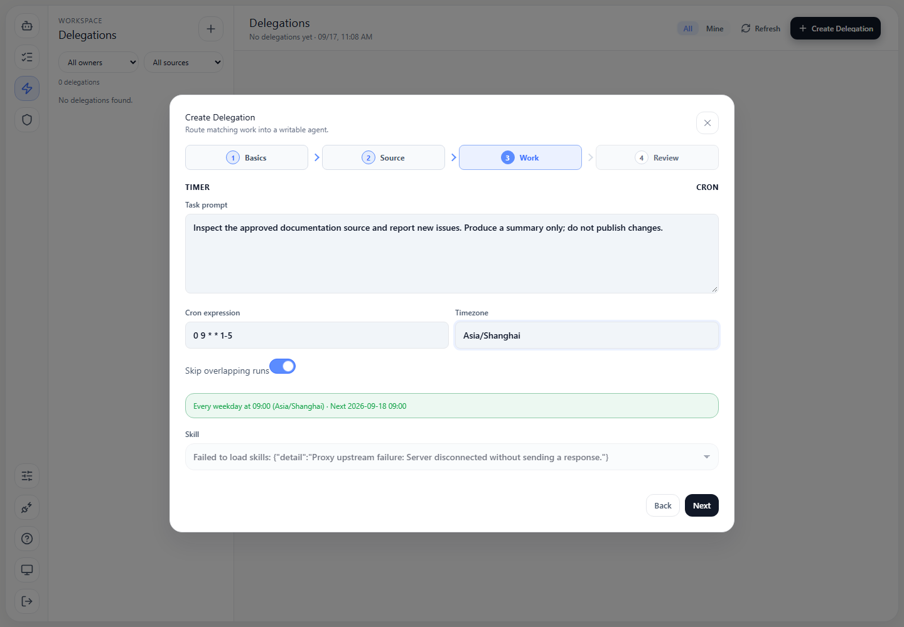

*The green preview confirms that the cron expression and timezone can be interpreted. This local demonstration also shows **Failed to load skills** because no runtime is connected. A valid schedule preview alone does not make the delegation runnable: resolve runtime and skill loading before creating or enabling it.*

Cron has five fields here: minute, hour, day of month, month, and day of week. `0 9 * * 1-5` means 09:00 Monday through Friday in the specified timezone. Use the schedule preview and confirm the displayed next occurrence. Your browser's local display time and the rule's execution timezone may differ.

Leave **Skip overlapping runs** on unless parallel work is intentional. The selected skill must actually support the prompt and the connected sources.

### Operate and diagnose a rule

Open a delegation to inspect **Last Run**, **Next Run**, recent runs, discovered events, created tasks, skipped items, and reply/completion status.

- **Run once** checks/executes the rule now. It can create real tasks and external replies; it is not a dry-run preview.
- **Pause** prevents future scheduled checks. It does not automatically cancel a task already started; manage that task separately.
- **Enable** resumes the rule. Confirm the target and source first.
- **Edit** changes the rule. If its assistant was deleted, use the repair/edit action to select a replacement.
- **Delete** removes the rule after confirmation. Save any information you need first.

Only the delegation's owner can manage it, even when another account can view it. An enabled rule still needs the worker, runtime, credentials, and matching source events to function. An empty run can be valid: there may simply be no new matching work.

GitHub review requests are deduplicated. When a newer pull-request head supersedes older review work, the older task may become **Stale**. A task finishing and its external reply being sent are separate outcomes; inspect both if the source page has no reply.

## 14. Connect your local browser

The local browser connector lets the assistant operate a separate EFP Chrome window on your computer. That window has its own browser profile and logins. Open Portal in a supported Chromium browser such as Chrome or Edge, and use an assistant you own (or can manage as an administrator). A shared assistant owned by someone else cannot complete the connector response path.

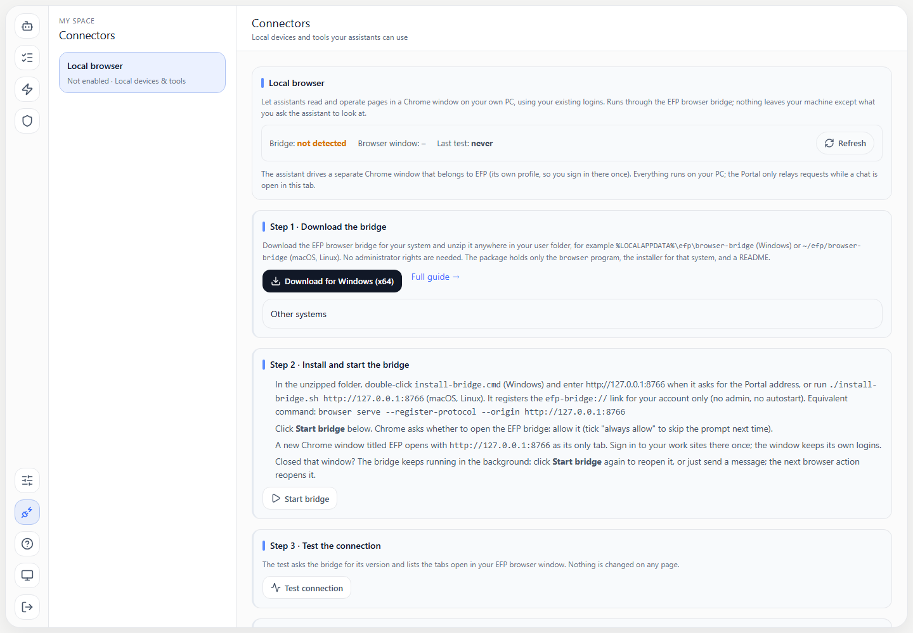

*Figure 13. The setup panel checks the bridge on your computer. The screenshot has no bridge running.*

1. Open **Connectors → Local browser**. If Connectors is absent, ask whether the deployment enabled it.
2. **Download:** choose your operating system and processor architecture, download the bridge package from your Portal, and unzip it into a folder you can keep, such as a folder under your user directory. Use **Other systems** if the suggested package is wrong.
3. **Install and start:** on Windows, run `install-bridge.cmd` and enter the Portal address shown by the panel. On macOS/Linux, run `./install-bridge.sh <Portal-origin>` from the unzipped folder, replacing the placeholder with the panel's exact address. Follow the package README for any platform-specific steps. Click **Start bridge** and accept the browser's prompt to open the installed launcher.
4. In the separate EFP browser window, sign in to the sites the assistant needs. Your everyday Chrome profile's logins are not automatically copied.
5. Return to Portal and click **Test connection**. The test checks bridge information and lists open tabs; it does not change a website.
6. Enable the connector, choose whether it should start **On by default in new chats**, and click **Save**. Leave the port at `8765` unless you have deliberately configured another port.
7. Open an assistant chat and turn on its **Browser** composer toggle.
8. Keep that Portal tab open while the assistant uses the browser. Begin with a read-only request, such as listing the open tabs or summarizing the visible test page.

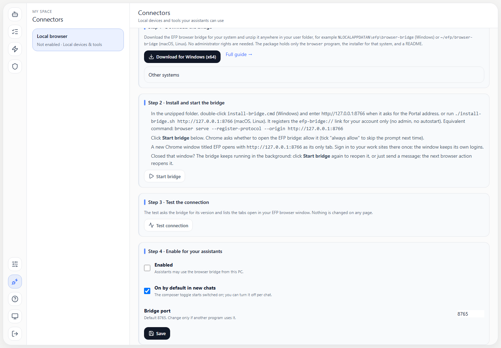

*Save these preferences after installing and testing the bridge. The local demonstration has no bridge running; the switches alone do not establish a connection.*

**Success check:** the bridge/test state reports a usable connection, the EFP window is available, and a supported browser request returns a result. Enabling the preference alone does not start a bridge or prove that the runtime supports the connector.

The Portal tab relays runtime browser requests to the local bridge. Background tasks and timers cannot rely on your computer being reachable after you close that tab. Do not assume the connector is an unattended server-side browser.

If you close only the EFP browser window, the bridge may continue running. **Start bridge** or a later browser action can reopen it. If the Portal address changes, restart the bridge for the new origin. For `origin_denied`, a blocked local-network permission, or `devtools_unavailable`, follow the panel's troubleshooting and ask your administrator about managed browser policy. If the package download returns 404, the operator must publish the bridge packages or configure their download URL.

## 15. Administration

This section requires the **Admin** role. Platform installation, storage, SSO, and upgrade procedures are in the [Operations Guide](OPERATIONS_GUIDE.md).

### Member access and roles


*Figure 14. Member management separates permission to enter Portal from the account's role.*

1. Open **Administration → User Management**.
2. Click **Add to allowlist**, enter the actual sign-in usernames (one per line), choose their shared **Initial role**, and click **Allow users**. With enterprise username normalization, use the Portal usernames your deployment expects.
3. Ask the member to sign in using the approved external method. Their account is created on first eligible sign-in.
4. Search the registered-member list and use the access filter to find the account.
5. Review the member's assistant/task/activity counts. These are Portal activity summaries, not a provider invoice.
6. Change the **User/Admin** control only when the member's role should change. The selection saves immediately; wait for its status feedback. You cannot demote your own account through this control.
7. To revoke access, click **Revoke** on the registered member and read the confirmation. Use **Allow** to restore access. For an allowlisted person who has not signed in yet, expand **Pending registration** and use **Remove** to withdraw their entry; this label does not mean a self-service registration form exists.

Removing allowlist access blocks continued use as well as future sign-in. It does not delete the account's stored work. Environment-configured entries are reconciled at startup, so operators must also update deployment configuration when revoking an entry that it supplies.

### Assistant types

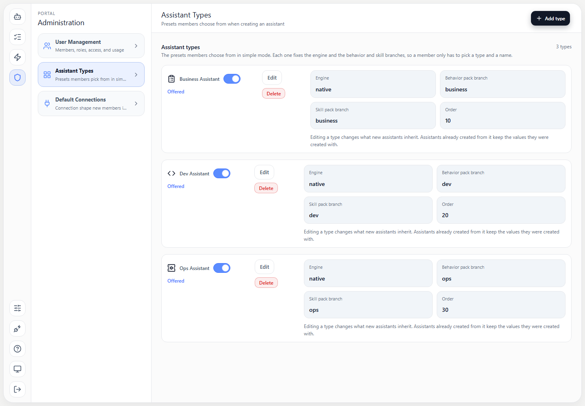

*Figure 15. Types determine what members can choose in simple setup.*

1. Open **Assistant Types** and click **Add type**, or edit an existing type.
2. Give it a name and a short description that explains the work it is for.
3. Select an icon and an engine enabled by the deployment.
4. Set the approved behavior and skill branches and sort order. Lower sort values appear earlier.
5. Click **Add type** for a new type or **Save changes** when editing. On the type's card, the switch changes **Offered/Hidden** immediately. Verify that an offered type appears in a member's create-assistant dialog.

These are presets for new assistants. Editing a type does not automatically reconfigure all assistants previously created from it. Hiding a type removes it from normal new-assistant choices; it does not stop existing assistants. **Delete** removes the preset after confirmation and also leaves existing assistants unchanged. Keep at least one suitable type offered if members should use simple setup.

### Default Connections

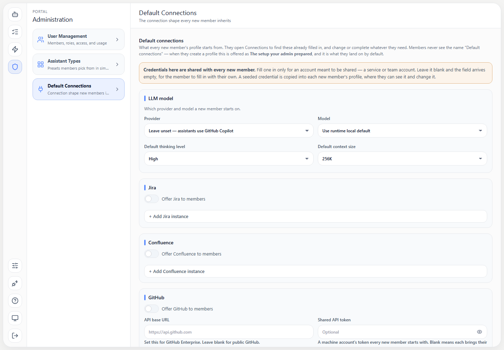

*Figure 16. Administrators prepare the starting settings for new profiles, with optional shared service-account credentials.*

1. Open **Default Connections**.
2. Enable the services your organization offers and enter endpoints, instance names, and other starting settings. Leave credential fields empty for members to fill, or enter only an approved service/team credential intended to be shared.
3. Save the defaults.
4. Verify the result with a newly created profile using **The setup your admin prepared**, or with a new member's first profile. Existing profiles keep their previous copies; saving defaults does not update or restart their assistants.

**Credentials entered here are copied into new profiles and can be seen and changed by those members.** Do not enter a personal token or a credential that must remain private to administrators. Blank credential fields stay blank. This is a starting template, not ongoing central enforcement: subsequent changes to the default setup do not reach profiles that already exist. Coordinate changes or credential rotation with members who hold an earlier copy.

## 16. Help, shortcuts, and smaller screens

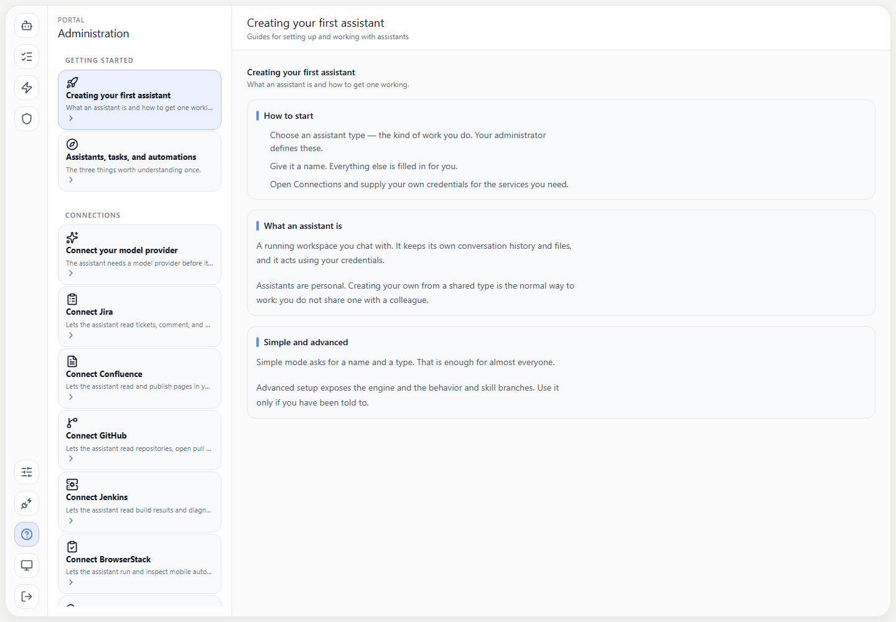

*Figure 17. Help is available from the rail and from connection setup links.*

Open **Help** for getting started, connection-specific instructions, the local browser connector, questions/approvals, failures, and shortcuts. Connection forms link directly to the matching help topic.

| Shortcut | Action |
| --- | --- |
| `Ctrl + K` on Windows/Linux; `Command + K` on macOS | Focus the message box |
| `/` outside a text field | Focus the message box; typing `/` in the composer can open skill choices |
| `Ctrl + Shift + O` / `Command + Shift + O` | Start a new chat |
| `Enter` | Send a message |
| `Shift + Enter` | Insert a new line |
| `Esc` | Close the current dialog, or stop the current run as applicable |

On smaller screens, lists and utility panels become drawers. Open the relevant navigation/list control, select an item, and close the drawer to return to the main content. If a utility covers another control, close that utility first. Use a desktop screen for the longer administration and connection forms when possible.

## 17. Troubleshooting

Start with the failing layer: Portal login, assistant startup, model connection, service permissions, or one particular workflow.

| Symptom | First action | Escalate when |
| --- | --- | --- |
| Not on the allowlist | Give your administrator the Portal username shown | You were added but still cannot enter; check username normalization and the active entry |
| No registration button | Use the organization's sign-in method | You were expecting a password account; self-service registration was removed |
| No assistant types | Ask for an active type backed by an enabled engine | The type's engine is disabled or the type was removed |
| Assistant is starting for a long time | Read its startup details and wait for image/asset provisioning | There is an image, capacity, volume, or repository error |
| Running, but chat cannot connect | Check whether this is local `K8S_ENABLED=false` mode; then check runtime connectivity | The runtime's pod/service or network path is unavailable |
| Immediate model credential failure | Reauthorize the model in the correct profile, save, and wait for restart | Entitlement, central AI Platform configuration, or network policy is wrong |
| Jira/GitHub test fails | Check the selected instance, token, enabled state, and account permissions | The endpoint or managed settings need changing |
| Skills do not load | Confirm the assistant runtime is reachable | Skill repo clone/branch/layout or runtime capability is wrong |
| A setting changed several assistants | Inspect which profile they share | Restore/correct that profile and coordinate restarts |
| Attachment fails | Check size, upload completion, and assistant connection | Portal/runtime/ingress upload limits disagree |
| Reply stops or page reconnects | Reopen the same session and inspect pending work | Avoid resending a write until you know whether it completed |
| Task stays queued/running | Open details; inspect the target assistant and recent errors | Worker/reconciliation/runtime services need operator attention |
| Delegation creates no tasks | Check enabled state, source readiness, scope, timezone, preview, and recent runs | The worker is off, credentials fail, or the selected skill is unavailable |
| Task completed but no source reply | Read the delegation event's reply status | Reply permissions/network failed separately from execution |
| Browser bridge not detected | Start it and test from this computer and Portal origin | Local-network permission, origin, port, or managed Chrome policy blocks it |
| A button is disabled | Read the tooltip and check ownership, runtime capability, and current state | The required state is correct but the UI does not recover after refresh |

When reporting a problem, include the Portal address, assistant/task/rule ID, approximate time and timezone, exact error text, and the steps immediately before it. A screenshot of the error is useful; keep passwords, tokens, and unrelated private information out of it. Operators can correlate requests with the response's `X-Trace-Id` and server logs.

See [Kubernetes troubleshooting](K8S_TROUBLESHOOTING.md) for runtime networking and startup diagnostics.

## 18. Practice workflow and completion checklist

Try this sequence on a configured deployment:

1. Sign in and create your personal Dev or Business Assistant.
2. Authorize its model, save the profile, and receive a simple reply.
3. Connect one read-only source you need and successfully retrieve a known item.
4. Attach a small sample document and ask for a summary. Download a generated result if the workflow produces one.
5. Start a new chat, then reopen the earlier session through **Sessions**.
6. Start a small background task with an installed skill. Open its result and inspect any error or completion state.
7. Create a disabled Timer delegation, verify its timezone and next-run preview, then enable it only when its task prompt and target are correct.
8. If browser automation is needed, install/test the local bridge and verify a read-only browser action with the Portal tab open.

You are ready for routine use when you can explain which assistant and profile a request uses, find its conversation or task result, identify an approval/question, and stop or pause the relevant work. For an action that writes to another service, inspect the result in that service as well.

## 19. Glossary and further reading

| Word | Meaning |
| --- | --- |
| Allowlist | The usernames permitted to use Portal |
| SSO | Single sign-on through your organization's identity provider |
| Token | A credential authorizing access to a service |
| Runtime/engine | The service implementation that runs the assistant |
| Branch | A named version of a Git repository |
| Behavior pack | Repository content defining instructions and optional Portal greeting/starter cards |
| Workspace | The assistant's persistent working files |
| Context | The conversation and other material supplied to the model for a run |
| Cron/timezone | A schedule expression and the clock region used to interpret it |
| Origin | The scheme, host, and port of your Portal address, used by the browser bridge to control access |

- [Repository overview and quick start](../README.md)
- [Installation, deployment, upgrades, APIs, and maintenance](OPERATIONS_GUIDE.md)
- [Kubernetes deployment guide](../k8s/README.md)
- [Kubernetes troubleshooting](K8S_TROUBLESHOOTING.md)
- [Portal/runtime contract](PORTAL_RUNTIME_CONTRACT.md)
- [Connector contract](CONNECTORS_CONTRACT.md)
- [Phase 5 compatibility and upgrade notes](PHASE5_PRODUCTIZATION.md)
- [Integration testing guidance](../integration/README.md)
