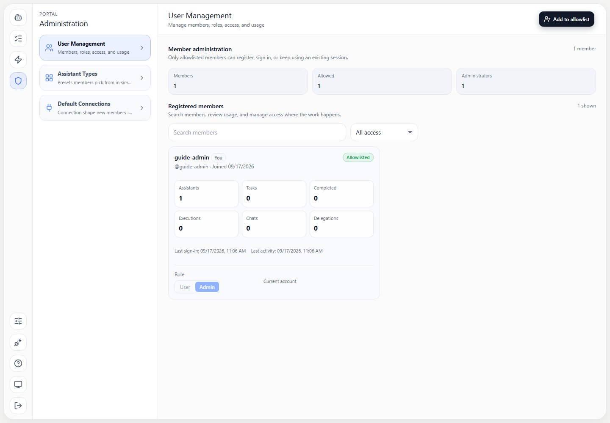

# Portal Operations and Development Guide

This guide is for someone installing, administering, upgrading, or developing Engineering Flow Platform Portal for the first time. It describes the implementation at Git commit `021baaafdc3f2406540b467596c6ba961ad821d5`. Commands are instructions to run in your own environment, not a claim that your environment has already been deployed or tested.

For illustrated instructions on signing in, creating assistants, chatting, files, tasks, delegations, connections, and administration, start with the [Beginner Guide](BEGINNER_GUIDE.md). This companion explains what must run behind those screens.

## Contents

1. [Understand what you are installing](#1-understand-what-you-are-installing)
2. [Install locally on Windows](#2-install-locally-on-windows)
3. [Install locally on macOS or Linux](#3-install-locally-on-macos-or-linux)
4. [Create your local configuration](#4-create-your-local-configuration)
5. [Start and verify Portal](#5-start-and-verify-portal)
6. [Run with Docker and persistent storage](#6-run-with-docker-and-persistent-storage)
7. [Connect real assistant runtimes](#7-connect-real-assistant-runtimes)
8. [Deploy to Kubernetes in the right order](#8-deploy-to-kubernetes-in-the-right-order)
9. [Manage sign-in and member access](#9-manage-sign-in-and-member-access)
10. [Configure engines, profiles, repositories, and resources](#10-configure-engines-profiles-repositories-and-resources)
11. [Provide local browser connectors](#11-provide-local-browser-connectors)
12. [Monitor workers, logs, and availability](#12-monitor-workers-logs-and-availability)
13. [Back up, upgrade, and recover](#13-back-up-upgrade-and-recover)
14. [Explore the API](#14-explore-the-api)
15. [Develop and test changes](#15-develop-and-test-changes)
16. [Troubleshoot common problems](#16-troubleshoot-common-problems)
17. [Reference documents and source files](#17-reference-documents-and-source-files)

## 1. Understand what you are installing

Portal is the website and control plane. It keeps users, allowlist entries, assistant definitions, runtime profiles, tasks, delegation rules, and other metadata in its database. An assistant runtime is a separate service that performs AI work and owns its tools, skills, conversations, and workspace files. The browser normally talks to Portal; Portal forwards runtime requests through `/a/{agent_id}/...`.

| Component | What it does | What you need |
| --- | --- | --- |
| Portal | Serves the website, authenticates members, manages assistants and tasks | Python dependencies or the Portal Docker image; a writable database |
| Database | Stores Portal configuration and metadata | SQLite is the supplied default; persist and back up its file |
| Kubernetes | Creates assistant Deployments, Services, and profile Secrets | A working cluster, access credentials, permissions, and storage |
| Runtime image | Runs the native EFP engine or the OpenCode adapter | An image compatible with the Portal/runtime contract |
| Model provider | Supplies AI inference | Valid GitHub Copilot authorization or deployment-configured AI Platform credentials |
| Runtime storage | Holds assistant workspaces and runtime state | A suitable persistent volume accessible from the runtime pods |
| External connections | Let assistants use services such as GitHub, Jira, or Confluence | Service-specific credentials and network connectivity |

**A local Portal with `K8S_ENABLED=false` is useful for learning the interface and developing the control plane. It does not create a working AI runtime.** The disabled Kubernetes service can return a simulated `running` status without creating any pod. A green assistant status alone is therefore not proof that chat, skills, files, usage, or task execution work. A healthy runtime and provider are required for those features.

The default source checkout uses SQLite, which Python can access without a separately installed database server. A standalone `sqlite3` command-line program is optional. The supplied dependencies do not include drivers for every other SQL database; changing `DATABASE_URL` alone does not establish support for an untested database backend.

## 2. Install locally on Windows

Use PowerShell. Install Git and Python 3.11 first; Python 3.11 is used by the Dockerfile and CI. A Python virtual environment keeps this project's packages separate from your other projects. Node.js 20 is needed for the JavaScript checks in section 15, not for starting Portal.

Open PowerShell in the parent folder where you want the repository, then run:

```powershell
git --version
py -3.11 --version
git clone --branch master https://github.com/dvnuo/engineering-flow-platform-portal.git
Set-Location engineering-flow-platform-portal
git rev-parse HEAD
py -3.11 -m venv .venv
.\.venv\Scripts\python.exe -m pip install --upgrade pip
.\.venv\Scripts\python.exe -m pip install -r requirements.txt
```

If `py -3.11` is unavailable, install Python 3.11 or use the full path to that interpreter. Do not accidentally use a different Python installation for package installation and server startup. These instructions call the virtual environment's interpreter directly, so changing PowerShell execution policy or activating a script is unnecessary.

If you already have the repository, do not clone inside it. Check for local work before updating:

```powershell
git status --short
git fetch origin master
git log -1 --oneline origin/master
```

For an existing deployed installation, follow section 13 before updating its working copy. For a clean, unused checkout on `master`, `git pull --ff-only origin master` advances it without creating a merge commit. If it fails because branches have diverged, review the changes; do not delete local work to force the update.

Continue with section 4 before running migrations or the server.

## 3. Install locally on macOS or Linux

Use a terminal with Git and Python 3.11 available. On some Linux distributions, the virtual-environment support is packaged separately; install the distribution's Python 3.11 virtual-environment package if `venv` reports that it is missing.

```bash
git --version
python3.11 --version
git clone --branch master https://github.com/dvnuo/engineering-flow-platform-portal.git
cd engineering-flow-platform-portal
git rev-parse HEAD
python3.11 -m venv .venv
.venv/bin/python -m pip install --upgrade pip
.venv/bin/python -m pip install -r requirements.txt
```

If your Python 3.11 executable is named `python3`, use that name to create the environment after checking its version. Subsequent commands still use `.venv/bin/python`. There is no need to install these packages with `sudo`.

For an existing checkout, use the same `git status`, `git fetch`, and clean-checkout precautions described for Windows. Continue with section 4.

## 4. Create your local configuration

All commands in this guide run from the repository root, the directory containing `requirements.txt` and `alembic.ini`. Portal reads a UTF-8 file named `.env` there. Operating-system environment variables override values in that file. Settings are cached in a running process, so restart Portal after changing them.

Use your text editor to create `.env`. On Windows, make sure the filename is `.env`, not `.env.txt`. Start with:

```dotenv
DATABASE_URL=sqlite:///./portal.db
SECRET_KEY=REPLACE_WITH_A_LONG_RANDOM_VALUE
BOOTSTRAP_ADMIN_USERNAME=admin
BOOTSTRAP_ADMIN_PASSWORD=REPLACE_WITH_A_STRONG_UNIQUE_PASSWORD
K8S_ENABLED=false
SSO_ISSUER_URL=
COPILOT_LOGIN_ENABLED=false
PORTAL_USER_ALLOWLIST=
PORTAL_SUPPORT_CONTACT=Your Portal administrator
```

Replace both `REPLACE_...` values before continuing. Generate a random session signing secret with the appropriate command, then paste its output into `SECRET_KEY`:

```powershell
# Windows
.\.venv\Scripts\python.exe -c "import secrets; print(secrets.token_urlsafe(48))"
```

```bash
# macOS or Linux
.venv/bin/python -c 'import secrets; print(secrets.token_urlsafe(48))'
```

Use a password manager for the administrator password. Quote `.env` values if they contain spaces or characters interpreted by dotenv syntax. Keep `.env` private; the repository's `.gitignore` excludes it. Do not paste it into bug reports or screenshots.

What these settings mean:

| Setting | Explanation |
| --- | --- |
| `DATABASE_URL` | `sqlite:///./portal.db` creates the file relative to the working directory. Starting from another directory can accidentally select another database. |
| `SECRET_KEY` | Signs login sessions. Keep it stable across restarts. Changing it invalidates existing session signatures. |
| `BOOTSTRAP_ADMIN_USERNAME` / `BOOTSTRAP_ADMIN_PASSWORD` | Create the initial administrator after schema migration. The configured administrator is also added to the allowlist. |
| `K8S_ENABLED=false` | Runs the control plane without provisioning real assistant pods. |
| `SSO_ISSUER_URL=` | Leaves company SSO disabled for this local exercise. |
| `COPILOT_LOGIN_ENABLED=false` | Hides external Copilot sign-in for the first local run. This setting controls login, not the runtime's model-provider catalog. |
| `PORTAL_USER_ALLOWLIST` | Optional comma-, semicolon-, or newline-separated usernames to seed on startup. Adding a name here does not create a password account. |
| `PORTAL_SUPPORT_CONTACT` | Contact text or a supported `mailto:`/`https:` link shown to members who lack access. |

The bootstrap password is not a general password-reset mechanism. If the configured account already exists as an administrator, startup does not replace its password with a new value from `.env`.

For a UI-only development session, you can additionally disable the background workers:

```dotenv
DELEGATION_RULES_WORKER_ENABLED=false
AGENT_TASK_RECONCILE_WORKER_ENABLED=false
IDLE_AGENT_STOP_WORKER_ENABLED=false
```

Do not leave delegation or reconciliation workers disabled when you expect scheduled work and runtime task tracking to operate.

## 5. Start and verify Portal

### Step 1: Create or upgrade the schema

Run migrations **before** starting a local Python server, even for an empty database.

Windows:

```powershell
.\.venv\Scripts\python.exe -m alembic upgrade head
.\.venv\Scripts\python.exe -m alembic current
.\.venv\Scripts\python.exe -m alembic heads
```

macOS or Linux:

```bash
.venv/bin/python -m alembic upgrade head
.venv/bin/python -m alembic current
.venv/bin/python -m alembic heads
```

`upgrade head` applies the repository's migrations. `current` shows the database revision; `heads` shows the latest revision in the checked-out migration files. They should agree after a successful upgrade. The startup schema guard deliberately rejects incomplete schemas; starting Uvicorn is not a substitute for migrations.

### Step 2: Start the development server

Windows:

```powershell
.\.venv\Scripts\python.exe -m uvicorn app.main:app --host 127.0.0.1 --port 8000 --reload
```

macOS or Linux:

```bash
.venv/bin/python -m uvicorn app.main:app --host 127.0.0.1 --port 8000 --reload
```

Keep this terminal open. `--reload` restarts the development process when source files change. Use **Ctrl+C** to stop it. Binding to `127.0.0.1` makes this local exercise available only from your own computer.

### Step 3: Confirm the process is available

Open a second terminal. On Windows:

```powershell
Invoke-RestMethod http://127.0.0.1:8000/health
Invoke-RestMethod http://127.0.0.1:8000/actuator/health
```

On macOS or Linux:

```bash
curl --fail http://127.0.0.1:8000/health
curl --fail http://127.0.0.1:8000/actuator/health
```

Both endpoints return `{"status":"ok"}`. These are Portal liveness responses, not end-to-end checks of the database, cluster, runtime, model provider, or connectors.

### Step 4: Sign in

Open [the administrator login](http://127.0.0.1:8000/admlogin) and enter the configured bootstrap username and password. The `/admlogin` route always offers the password form to an anonymous visitor, including when external login is enabled. Open [Portal](http://127.0.0.1:8000/app) after signing in.

If port 8000 is already in use, stop the other process or start Portal with `--port 8001` and use port 8001 in all local URLs. The illustrated [Beginner Guide](BEGINNER_GUIDE.md) takes over from this point.

## 6. Run with Docker and persistent storage

This is an alternative to the Python setup. Install and start Docker with Linux-container support. Run the following commands from the repository root; they are single-line commands usable in PowerShell and POSIX shells:

```text
docker build -t efp-portal:local .
docker volume create efp-portal-data
```

Create a private file named `portal-docker.env` with:

```dotenv
DATABASE_URL=sqlite:////app/data/portal.db
SECRET_KEY=REPLACE_WITH_A_LONG_RANDOM_VALUE
BOOTSTRAP_ADMIN_USERNAME=admin
BOOTSTRAP_ADMIN_PASSWORD=REPLACE_WITH_A_STRONG_UNIQUE_PASSWORD
K8S_ENABLED=false
SSO_ISSUER_URL=
COPILOT_LOGIN_ENABLED=false
FORWARDED_ALLOW_IPS=127.0.0.1
```

Replace the secrets. Unlike `.env`, `portal-docker.env` is not covered by the repository's existing ignore rule; keep it outside the repository or add its exact name to your local `.git/info/exclude` before using `git add`. If kept outside the repository, pass its actual path to `--env-file` below.

```text
docker run -d --name efp-portal --restart unless-stopped -p 127.0.0.1:8000:8000 --env-file portal-docker.env -v efp-portal-data:/app/data efp-portal:local
docker logs --tail 100 efp-portal
```

The four slashes in `sqlite:////app/data/portal.db` are intentional: this is an absolute Unix path inside the container. The named volume holds the database even if the container is replaced. The image contains application code; the volume contains data. Do not mount an empty volume over `/app`, which would hide the application.

**The current Docker entrypoint automatically runs `alembic upgrade head` before Uvicorn.** Expect migration output before the server-start message. A migration failure prevents server startup. Back up an existing database before starting a newer image against its volume.

Verify [health](http://127.0.0.1:8000/health) and [administrator sign-in](http://127.0.0.1:8000/admlogin) as in section 5. This example still runs without a real assistant runtime.

Useful lifecycle commands:

```text
docker stop efp-portal
docker start efp-portal
docker logs --follow efp-portal
```

Stopping preserves the container and volume. For an upgrade, replace the container while reusing the named volume only after following section 13. Removing the volume deletes the persisted data. `--restart unless-stopped` restarts the container when Docker restarts, unless you explicitly stopped it.

For a deployment behind a reverse proxy, configure trusted proxy addresses with `FORWARDED_ALLOW_IPS`. The image defaults to `*` because its expected Kubernetes topology places it behind ingress; the local example explicitly limits that trust. Configure HTTPS and the actual ingress routing as part of a network deployment.

## 7. Connect real assistant runtimes

Before expecting an assistant to answer a prompt, arrange all of the following:

1. A reachable Kubernetes API, with Portal authorized to manage the assistant namespace.
2. A suitable runtime image for every enabled engine and image-registry access from cluster nodes.
3. Persistent runtime storage and working DNS/networking from Portal to each assistant Service.
4. Reachable agent-settings and skills repositories, with clone credentials if private.
5. A runtime profile with valid model-provider authorization and any required external connections.
6. Runtime-to-Portal connectivity when your runtime uses Portal callbacks.

The supported runtime markers are `native` and `opencode`. Both are presented through the Portal runtime contract; the OpenCode adapter's internal port is not the browser's entry point. See the [runtime contract](PORTAL_RUNTIME_CONTRACT.md) for request and ownership boundaries.

### Portal inside the cluster

Set `K8S_ENABLED=true` and `K8S_INCLUSTER=true`; use the `portal` ServiceAccount and RoleBinding from the manifests. The default assistant service type is `ClusterIP`. Portal resolves assistant Services using cluster DNS on port 8000.

### Portal outside the cluster

Set `K8S_ENABLED=true`, `K8S_INCLUSTER=false`, and `K8S_KUBECONFIG` to a real kubeconfig file readable by the Portal process. A kubeconfig that works on your host is not automatically available inside a Docker container: mount it, along with any separately referenced certificates or credentials, if using Docker.

The computer running Portal must also reach the assistant Services. A normal `ClusterIP` and `*.svc.cluster.local` address are usually unavailable outside the cluster. If using the implemented NodePort path, set `K8S_AGENT_SERVICE_TYPE=NodePort` and `K8S_NODE_IP` to a Kubernetes node IP reachable **from Portal**. It is not the Portal computer's IP unless that computer is also the correct reachable Kubernetes node. Restrict runtime exposure to the trusted network described by the runtime contract.

`K8S_NODE_IP` is read directly from the process environment, so putting it only in `.env` does not work. Set it in the same shell that starts Portal, or supply it through the container environment, then restart Portal:

```powershell
# Windows: replace the example with your reachable Kubernetes node address.
$env:K8S_NODE_IP = "192.0.2.10"
```

```bash
# macOS or Linux: replace the example with your reachable Kubernetes node address.
export K8S_NODE_IP="192.0.2.10"
```

The fallback address detection inspects Portal's host/container, not the cluster's nodes. Also, changing `K8S_AGENT_SERVICE_TYPE` does not convert existing runtime Services; see [the Service troubleshooting steps](K8S_TROUBLESHOOTING.md#3-check-the-runtime-service-and-endpoints) before changing an existing deployment's networking.

Kubernetes initialization errors currently cause the Kubernetes service to fall back to disabled mode. Therefore, validate that a real Deployment and pod were created; merely setting `K8S_ENABLED=true` is insufficient evidence.

## 8. Deploy to Kubernetes in the right order

Use [the Kubernetes deployment guide](../k8s/README.md) and [Kubernetes troubleshooting](K8S_TROUBLESHOOTING.md) alongside this sequence. The checked-in YAML files are examples that require environment-specific changes.

### Step 1: Inspect your context and prerequisites

```text
kubectl config current-context
kubectl cluster-info
kubectl get nodes
kubectl get storageclass
```

Confirm that this is the intended cluster. Arrange an ingress controller, DNS, certificates, registry access, and persistent storage with the cluster administrator. The repository does not install every cluster prerequisite.

The sample Portal namespace is `default`; the assistant namespace is `efp-agents`. If you change these, update the Deployment, Secrets, ServiceAccount, RoleBinding subject, Service, ingress, claims, and internal callback URL consistently.

### Step 2: Prepare storage and access

Review `k8s/efp-efs-pvc.yaml` before applying it. Despite its filename, its supplied volumes use **hostPath**, not an EFS driver. Marking a hostPath volume `ReadWriteMany` does not make data shared between nodes. For production or multiple nodes, provide storage with the access semantics your pods actually need; for a single-node lab, understand which node and disk hold the data.

Portal expects `efp-portal-efs-pvc` in the Portal namespace. Runtime Deployments use the shared claim `efp-agents-efs-pvc` in the assistant namespace, with separate subdirectories for assistants. Verify the storage class, access modes, capacity, permissions, and backup procedure before continuing.

Apply the namespace and permissions first:

```text
kubectl apply -f k8s/namespaces.yaml
kubectl apply -f k8s/service-account.yaml
```

Apply the storage manifest only after adapting it to your environment, then check claims in both namespaces:

```text
kubectl apply -f k8s/efp-efs-pvc.yaml
kubectl get pvc -n default
kubectl get pvc -n efp-agents
```

Claims must become `Bound`. Do not continue treating a `Pending` claim as an application problem.

### Step 3: Configure Secrets and the Deployment

Prepare the Portal and assistant Secret examples through your normal private configuration process:

| Secret | Namespace in the samples | Purpose |
| --- | --- | --- |
| `efp-portal-secret` | `default` | Bootstrap administrator password; optional Portal source-clone and private branch-listing token |
| `efp-agents-secret` | `efp-agents` | Optional settings/skills clone token; optional runtime `EFP_CONFIG_KEY` |
| `efp-profile-{profile_id}` | `efp-agents` | Generated by Portal from saved runtime profiles; contains `config.json` and `revision` |

Do not commit live credentials in the sample YAML. Secret existence and Secret references are separate requirements: adding a key to a Secret does nothing until the relevant container references it.

Before applying the Deployment, explicitly configure:

- A non-default `SECRET_KEY` supplied to the Portal container from a private Secret. The supplied examples do not automatically wire this key for you.
- `BOOTSTRAP_ADMIN_PASSWORD` and, if needed, `BOOTSTRAP_ADMIN_USERNAME`.
- `DATABASE_URL=sqlite:////app/data/portal.db` and the correct persistent mount.
- `K8S_ENABLED=true`, `K8S_INCLUSTER=true`, and the correct `AGENTS_NAMESPACE`.
- `PORTAL_INTERNAL_BASE_URL`, for example `http://efp-portal-service.default.svc.cluster.local` with the sample Service port 80.
- Real SSO settings, or an empty `SSO_ISSUER_URL` to disable SSO. The example company issuer, enterprise SSO URL, and GitHub username suffix are placeholders and must be replaced or cleared.
- Runtime images, engine availability, repositories, storage, resource limits, and provider configuration as described below.

Apply your prepared Secrets before creating pods that depend on them. The sample filenames are:

```text
kubectl apply -f k8s/portal-git-clone/efp-portal-secret.yaml
kubectl apply -f k8s/efp-agents-secret.yaml
```

For private branch discovery in the create-assistant wizard, the Portal main container needs `GIT_REPO_AUTH_PAT`; the example Deployment maps `efp-portal-secret.GIT_TOKEN` to it. Assistant init-container clones read the assistant namespace's token. A token in one namespace does not supply the other namespace's Secret.

### Step 4: Choose one Portal Deployment manifest

Both `k8s/efp-portal-deployment.yaml` and `k8s/portal-git-clone/efp-portal-deployment.yaml` define the same Portal Deployment/Service names. **Choose one and maintain your intended configuration there.** Applying both successively updates the same objects rather than creating two independently configured Portals.

| Deployment manifest | Portal Service type |
| --- | --- |
| `k8s/portal-git-clone/efp-portal-deployment.yaml` | `ClusterIP` |
| `k8s/efp-portal-deployment.yaml` | `NodePort` |

The samples clone source from `GIT_BRANCH=master` and overlay application and migration files on a prebuilt image. Keep `/app/app`, `/app/alembic`, and `/app/alembic.ini` from the same revision. The image supplies installed dependencies, so a new source checkout that changes `requirements.txt` also needs a matching rebuilt image. A moving branch and `latest` image are not reproducible release identifiers; record or pin the release you intend to run.

Validate your prepared manifests without persisting them first:

```text
kubectl apply --dry-run=server -f k8s/portal-git-clone/efp-portal-deployment.yaml
kubectl apply --dry-run=server -f k8s/efp-portal-ingress.yaml
```

Then apply the chosen Deployment and observe startup:

```text
kubectl apply -f k8s/portal-git-clone/efp-portal-deployment.yaml
kubectl rollout status deployment/efp-portal-deployment -n default
kubectl get pods -n default -l app=efp-portal-app
kubectl logs -n default deployment/efp-portal-deployment -c git-clone
kubectl logs -n default deployment/efp-portal-deployment -c portal-container --tail=100
```

Migrations run in the container entrypoint. An existing database must have been backed up **before** this deployment starts. Keep one Portal replica with the supplied SQLite arrangement; do not assume that adding replicas or Uvicorn processes produces a supported high-availability deployment.

### Step 5: Verify Portal before ingress

```text
kubectl port-forward -n default service/efp-portal-service 8000:80
```

While this command runs, use `http://127.0.0.1:8000/health` and `/admlogin`. Port forwarding is useful for initial password-login checks; an SSO callback still needs its registered public origin.

Configure your ingress host and TLS, then apply the adapted ingress manifest. Its backend is the Portal Service. Either Portal Service type above is distinct from `K8S_AGENT_SERVICE_TYPE`, which controls each runtime Service; an in-cluster Portal can use ClusterIP runtimes with either Portal manifest.

For streaming chat and events, preserve long-lived SSE and WebSocket connections through every proxy. The sample ingress has 3600-second read/send timeouts and a `30m` upload allowance; match the application/runtime upload limits when changing them.

### Step 6: Verify one real assistant end to end

1. Sign in and configure a valid runtime profile using the [Beginner Guide](BEGINNER_GUIDE.md).
2. Create one assistant with an enabled engine and start it.
3. Check `kubectl get deployments,pods,services -n efp-agents` and confirm that actual resources appeared.
4. Confirm the assistant pod becomes Ready. Runtime readiness checks use `GET /ready` on port 8000 and require successful boot-time profile projection.
5. Send a small prompt, wait for a real answer, and confirm that its session reopens.
6. Upload and retrieve a harmless test file; then test a connection-dependent action only after configuring that connection.

A Portal health response, a successful image pull, or a passing unit suite does not replace this live-runtime check.

## 9. Manage sign-in and member access

### Password, SSO, and Copilot login

| Method | Setup | Important behavior |
| --- | --- | --- |
| Administrator/password | Bootstrap settings; `/admlogin` | The account must exist and remain allowlisted. This is also the recovery entry point during external-login outages. |
| Company SSO | `SSO_ISSUER_URL`, public `BASE_URI`, client settings | First successful external sign-in provisions an eligible member. The implementation derives Keycloak-style `/protocol/openid-connect/auth` and `/token` paths from the issuer. |
| GitHub Copilot | `COPILOT_LOGIN_ENABLED=true`, GitHub connectivity, eligible GitHub account | Uses device authorization. First sign-in provisions an eligible member and stores the Copilot token on their default runtime profile. |

Self-service password registration is removed. `GET /register` redirects to `/login`; there is no current `POST /api/auth/register` endpoint. Administrators can create password accounts through the users API when needed. The illustrated User Management workflow primarily manages membership, roles, and access.

For SSO, register the exact callback `<BASE_URI>/auth` with the identity provider. `BASE_URI` is the browser-facing Portal origin, such as `https://portal.example.com`, not the cluster Service URL. Set `SSO_INTERNAL_ISSUER_URL` only when the Portal server must call a different address for token exchange. `SSO_CLIENT_ID` defaults to `webapp`; set `SSO_CLIENT_SECRET` for a confidential client and use the scope expected by your identity-provider setup. `SSO_SCOPE` defaults to `read write`. Keep `SSO_VERIFY_TLS=true` and arrange the appropriate CA trust.

For enterprise GitHub accounts, set `GITHUB_ENTERPRISE_SSO_URL` to your actual enterprise SSO page if members must visit it before authorization. Set `GITHUB_USERNAME_SUFFIX` only when the enterprise suffix must be stripped from GitHub logins to match Portal allowlist names. For example, the suffix `_example` maps `12345678_example` to `12345678`.

`GITHUB_PROXY_URL` and `SSO_PROXY_URL` have three modes: empty honors `HTTP_PROXY`/`HTTPS_PROXY`/`NO_PROXY`; `direct` ignores those proxy variables; a proxy URL explicitly selects that proxy. The GitHub call timeout is controlled by `GITHUB_HTTP_TIMEOUT_SECONDS` (default 30).

### Allowlist and roles

Use **Administration > User Management** to allow members individually or in bulk, assign `user` or `admin`, review their usage, and revoke access. The allowlist name must match the normalized identity returned by sign-in. SSO uses `preferred_username`, with email as a fallback; GitHub uses the login after any configured suffix normalization.



*The User Management interface in the local demonstration installation. The screenshot uses fictional data; it does not show a configured production runtime. See the [Beginner Guide](BEGINNER_GUIDE.md#15-administration) for the illustrated administration walkthrough and screenshot provenance.*

`user` members own and run their assistants. Administrators can manage all assistants and membership. There is no read-only `viewer` role in this version; the migration converts legacy viewers to users.

Every authenticated request checks the active allowlist. Removing access invalidates ongoing access even if a browser still has a session cookie. The API protects the configured bootstrap administrator, the acting administrator's own access, and the last effective administrator from removal or demotion.

Entries in `PORTAL_USER_ALLOWLIST` are reseeded/reactivated on startup. If you permanently revoke a name that is also configured there, remove it from deployment configuration too. The bootstrap administrator is also re-established in the allowlist on startup.

The current session cookie is signed, HTTP-only, SameSite Lax, and long-lived. Logging out clears the browser cookie; allowlist removal and changing `SECRET_KEY` are separate access controls. Protect public access with the intended HTTPS and trusted-network deployment.

## 10. Configure engines, profiles, repositories, and resources

### Engine availability and images

| Setting | Current default | Purpose |
| --- | --- | --- |
| `ENABLED_RUNTIME_TYPES` | `native` | Comma-separated `native`, `opencode`, or both; controls new-assistant and engine-switch choices |
| `DEFAULT_RUNTIME_TYPE` | `native` | Default engine; the exposed default is kept within the enabled set |
| `DEFAULT_AGENT_IMAGE_REPO` | `ghcr.io/dvnuo/engineering-flow-platform` | Native runtime image repository |
| `DEFAULT_AGENT_IMAGE_TAG` | `latest` | Native runtime image tag |
| `DEFAULT_OPENCODE_RUNTIME_IMAGE_REPO` | `ghcr.io/dvnuo/efp-opencode-runtime` | OpenCode adapter image repository |
| `DEFAULT_OPENCODE_RUNTIME_IMAGE_TAG` | `1.14.39` | OpenCode adapter image tag |

Use `GET /api/agents/defaults` after sign-in to inspect the offered defaults and engine matrix. Existing assistants retain their stored engine; disabling a marker for new assistants does not convert them. Creating or switching to a disabled engine is rejected with HTTP 422.

The Portal engine setting chooses a runtime implementation, not a model provider. This version's managed providers are **GitHub Copilot** and **AI Platform**. Unknown or legacy provider values are normalized by the profile policy; the authoritative catalog is [llm_catalog.py](../app/contracts/llm_catalog.py).

### Runtime profiles and default connections

Members configure their runtime profiles in Portal. Profiles carry the model selection and connection settings used by bound assistants. The Portal saves and projects these settings; the runtime owns how its tools use them.

**Saving a runtime profile can restart every running assistant bound to that profile.** Portal first synchronizes its Kubernetes Secret, then restarts bound running assistants so they read the new environment at boot. Schedule shared-profile changes accordingly and inspect the reported failed restarts. A Secret update alone does not change environment variables in an already running pod.

The administrator's **Default Connections** configuration seeds new members' default profiles. It can contain connection shapes and shared service/team credentials. Members own their copied values and can view or replace them; they are not locked administrator-only fields. Later seed edits never update existing profiles. Treat a seeded credential as shared with every member whose profile received it.

Agent settings, runtime profiles, and test controls are illustrated in the [Beginner Guide](BEGINNER_GUIDE.md). A connection test checks a specific connection; it is not a full assistant task or evidence that every external service is reachable from every pod.

### AI Platform deployment settings

Members provide their AI Platform username, password, and `usercase`. Operators provide the fixed endpoints and transport settings:

| Setting | Use |
| --- | --- |
| `AI_PLATFORM_CHAT_HOST` | Chat service host |
| `AI_PLATFORM_CHAT_URI` | Chat-completions path; default `/v1/api/v1/chat/completions` |
| `AI_PLATFORM_RESPONSES_URI` | Optional native Responses path; `{usercase}` is substituted from credentials. Empty keeps native chat-completions; OpenCode uses chat-completions. |
| `AI_PLATFORM_IB2B_HOST` / `AI_PLATFORM_IB2B_URI` | Token-service host and exchange path |
| `AI_PLATFORM_TRUST_TOKEN_HEADER` | Header carrying the exchanged trust token; set it to the gateway's required value |
| `AI_PLATFORM_TRACKING_PREFIX` | Correlation/session prefix; default `EFP` |

Without the deployment endpoints, selecting AI Platform and entering credentials is not a complete setup. Check the gateway contract and networking with its administrator.

### Profile encryption

If `EFP_CONFIG_KEY` is set in the **Portal process environment**, Portal encrypts sensitive values in generated runtime-profile Secret payloads as `ENC:` values. Runtime pods receive their copy from `efp-agents-secret.EFP_CONFIG_KEY`. Both must have the same key and compatible decryption support.

This setting is read directly from the process environment; unlike the Pydantic settings table, putting it only in the local `.env` file is not sufficient. Supply it through the process launcher or container environment. It encrypts selected fields in the generated Kubernetes payload, **not the entire Portal database**. Protect database backups as credential-bearing data. With the key unset, profile payload values remain plaintext. Encrypted values without the correct runtime key cause startup failure. Back up the key separately and plan rotation with profile Secret regeneration and runtime restarts.

### Agent-settings and skills repositories

| Setting family | What it controls |
| --- | --- |
| `DEFAULT_AGENT_SETTINGS_REPO_URL`, `DEFAULT_AGENT_SETTINGS_BRANCH` | Default agent-settings source; initially the `engineering-flow-platform-agents` repository on `master` |
| `DEFAULT_AGENT_SETTINGS_REPO_SUBDIR` | Optional selected subdirectory inside that repository |
| `DEFAULT_AGENT_SETTINGS_ASSET_VERSION` | Rollout marker when tracking the same settings branch |
| `DEFAULT_SKILL_REPO_URL`, `DEFAULT_SKILL_BRANCH` | Default skill package source; initially the `engineering-flow-platform-skills` repository on `master` |
| `DEFAULT_SKILL_REPO_SUBDIR` | Optional package root such as `skills` |
| `DEFAULT_SKILL_ASSET_VERSION` | Rollout marker when tracking the same skills branch |
| `DEFAULT_AGENT_GIT_IMAGE` | Git init-container image; default `alpine/git:latest` |
| `GIT_REPO_AUTH_PAT`, `GIT_REPO_AUTH_USERNAME` | Portal's private branch-listing credentials; default username `x-access-token` |
| `GIT_REPO_LS_REMOTE_TIMEOUT_SECONDS` | Branch-listing timeout; default 12 seconds |
| `K8S_GIT_TOKEN_KEY` | Key used in `efp-agents-secret` for init-container cloning; default `GIT_TOKEN` |

Skills are complete packages, normally `<skill-name>/SKILL.md` plus their scripts, templates, and other resources. Portal provisions the selected tree under `/app/skills`; it does not execute skills itself. Setting `DEFAULT_SKILL_REPO_SUBDIR=skills` selects the repository's `skills/` contents rather than adding an unwanted extra directory layer.

Asset-version values are rollout markers, not Git revisions. Updating a tracked Git branch by itself does not guarantee an existing runtime pod reclones it; use the supported settings/rollout workflow and verify the resulting pod. Runtime source overlays and a separate tools-repository provisioning surface are not provided.

Private business repositories used during an assistant task are checked out by the runtime on demand. Their authorization comes from the runtime profile/provider credentials. The broad init-clone `GIT_TOKEN` is not injected into runtime main containers as a general business-repository credential.

### Resource and storage settings

| Setting | Default | Meaning |
| --- | --- | --- |
| `DEFAULT_AGENT_CPU` | `250m` | New assistant CPU request; 250 millicores is one quarter of a core |
| `DEFAULT_AGENT_MEMORY` | `512Mi` | New assistant memory request |
| `DEFAULT_AGENT_CPU_LIMIT` | `1` | Runtime CPU ceiling; empty disables this limit |
| `DEFAULT_AGENT_MEMORY_LIMIT` | `2Gi` | Runtime memory ceiling; exceeding it can cause OOMKilled |
| `DEFAULT_AGENT_DISK_SIZE_GI` | `20` | Initial disk-size setting; not a per-assistant filesystem quota |
| `K8S_STORAGE_CLASS` | `local-path` | Storage class used if Portal creates the shared runtime claim |
| `K8S_PVC_ACCESS_MODES` | `["ReadWriteOnce"]` | JSON array of access modes used for claim creation |
| `AGENTS_NAMESPACE` | `efp-agents` | Assistant object namespace |
| `AGENTS_VOLUME_SUB_PATH_PREFIX` | `efp-agents` | Prefix for assistant paths on the shared volume |
| `EFP_MAX_UPLOAD_MB` | `25` | Portal attachment/workspace upload ceiling |

An empty CPU or memory request leaves that request unset. Set requests at or below their limits. Resource requests influence scheduling; they do not themselves reserve a separate machine for each assistant.

The code uses the shared claim `efp-agents-efs-pvc`; if it already exists, assistant creation does not resize it to a new assistant's disk setting. Defaults also do not automatically mutate every existing assistant or resize an existing claim. New assistants use `/workspace`; the presence of `DEFAULT_AGENT_MOUNT_PATH` in the settings class does not make it an effective creation override in this revision. Workspace files survive assistant runtime deletion on the shared volume, but deletion removes the Portal assistant and related runtime objects; retained files are not a complete recoverable assistant record. Prefer Stop for a temporary pause.

Increasing the upload ceiling requires matching the Portal setting, the runtime's effective limit, and every ingress/proxy limit. The lowest enforced limit wins. Verify the actual runtime deployment configuration instead of assuming that changing a Portal variable propagates every runtime setting.

### OpenCode-specific controls and capability alignment

OpenCode's deployment defaults include `DEFAULT_OPENCODE_PERMISSION_MODE=workspace_full_access` and `DEFAULT_OPENCODE_ALLOW_BASH_ALL=true`. Review these runtime permissions for your deployment. `OPENCODE_WORKSPACE_REPOS_DIR` defaults to `/workspace/repos`; checkout, task completion, and chat-submit budgets are controlled by `OPENCODE_GIT_CHECKOUT_TIMEOUT_SECONDS` (120), `OPENCODE_TASK_COMPLETION_TIMEOUT_SECONDS` (3600), and `OPENCODE_CHAT_SUBMIT_TIMEOUT_SECONDS` (900).

`RUNTIME_CAPABILITY_CATALOG_SNAPSHOT_JSON` optionally supplies a compatibility snapshot. Missing or invalid input falls back to local seed mappings; that fallback does not prove a real runtime has every capability. See the [productization notes](PHASE5_PRODUCTIZATION.md) for the snapshot structure and use the runtime-capability API to inspect or refresh deployed information.

## 11. Provide local browser connectors

`CONNECTORS_ENABLED=true` exposes the Connectors feature; setting it false disables its supported routes and menu entry. Local browser preferences belong to each member, separately from their Connections/runtime profile. The connector uses a program on that member's computer plus a relay in the open Portal browser tab.

The Portal repository does not build or bundle every platform's bridge binary. Supply the packages described in [the download directory guide](../app/static/downloads/README.md), or set `LOCAL_BROWSER_CLI_DOWNLOAD_URL` to a download URL. The optional `{platform}` placeholder expands to `windows-amd64`, `windows-arm64`, `darwin-arm64`, `darwin-amd64`, `linux-amd64`, or `linux-arm64`.

`LOCAL_BROWSER_CLI_VERSION` provides the displayed package version. `LOCAL_BROWSER_START_URL` selects the first browser tab; it can be an absolute HTTP(S) URL or a path such as `/app` resolved against Portal's origin. Empty uses the Portal origin.

Verify a package download for each operating system you support, then follow the illustrated member setup and **Test connection** action in the [Beginner Guide](BEGINNER_GUIDE.md#14-connect-your-local-browser). The test runs in the member's browser against the local bridge; `/api/connectors/local_browser/verify` records the reported outcome rather than making a server-side loopback request.

The default bridge port is 8765. The page can discover ports 8765-8770 and the member's preferred port. The bridge accepts its configured Portal origin; a changed Portal address may require restarting it with the new origin. A compatible Chromium browser, permitted local-network access, and the separate EFP Chrome window are part of the working setup. A running loopback service alone does not prove that its Chrome window is available.

During interactive chat, runtime connector events reach the originating Portal tab, which calls the local bridge and relays responses. Keep that tab open and use an assistant the member owns or can administer. This is not an unattended bridge for background tasks or timers, and runtimes do not directly connect to the member's `127.0.0.1`. See [the connector contract](CONNECTORS_CONTRACT.md) for request metadata, origin checks, event transport, and access rules.

## 12. Monitor workers, logs, and availability

### Background workers

Workers run inside the Portal process and start at application startup. They are not separate Kubernetes Jobs in the supplied deployment.

| Worker | Defaults | Responsibility |
| --- | --- | --- |
| Delegation rules | `DELEGATION_RULES_WORKER_ENABLED=true`; interval 15 seconds; lock lease 120 seconds | Polls eligible sources/schedules and processes delegation rules |
| Task reconciliation | `AGENT_TASK_RECONCILE_WORKER_ENABLED=true`; initial delay 30 seconds; interval 5 seconds; batch size 50 | Reconciles Portal task state with runtime execution state |
| Idle assistant stop | `IDLE_AGENT_STOP_WORKER_ENABLED=true`; initial delay 120 seconds; interval 600 seconds; batch size 100 | Stops eligible idle assistants to reclaim runtime resources |

The corresponding interval/batch variables are named `DELEGATION_RULES_WORKER_INTERVAL_SECONDS`, `DELEGATION_RULE_LOCK_LEASE_SECONDS`, `AGENT_TASK_RECONCILE_WORKER_INITIAL_DELAY_SECONDS`, `AGENT_TASK_RECONCILE_WORKER_INTERVAL_SECONDS`, `AGENT_TASK_RECONCILE_WORKER_BATCH_SIZE`, `IDLE_AGENT_STOP_WORKER_INITIAL_DELAY_SECONDS`, `IDLE_AGENT_STOP_WORKER_INTERVAL_SECONDS`, and `IDLE_AGENT_STOP_WORKER_BATCH_SIZE`.

`AGENT_IDLE_STOP_AFTER_SECONDS` defaults to 259200, or three days. Assistants with active tasks are skipped; eligible idle assistants are scaled to zero and later started manually. The audit action is `auto_stop_agent`. A stopped assistant after several quiet days may therefore be expected behavior rather than a crash.

Runtime task polling defaults to a 3600-second timeout and a one-second interval (`AGENT_TASK_RUNTIME_POLL_TIMEOUT_SECONDS`, `AGENT_TASK_RUNTIME_POLL_INTERVAL_SECONDS`). Reconciliation also uses bounded status-response size and missing/unreachable grace periods; consult [config.py](../app/config.py) before changing `AGENT_TASK_RUNTIME_STATUS_MAX_BYTES`, `AGENT_TASK_RUNTIME_MISSING_STALE_AFTER_SECONDS`, or `AGENT_TASK_RUNTIME_UNREACHABLE_STALE_AFTER_SECONDS`.

### Logs and request tracing

For local development, read the Uvicorn terminal. Add `DEBUG=true` to `.env` and restart for application debug logging when needed; `--log-level debug` controls Uvicorn logging. For Docker use `docker logs`; for Kubernetes:

```text
kubectl logs -n default deployment/efp-portal-deployment -c portal-container --tail=200
kubectl get pods -n efp-agents
kubectl get events -n efp-agents --sort-by=.lastTimestamp
```

Use a real pod name returned by the second command for `kubectl describe pod` and `kubectl logs`. An init-container failure needs the init container's logs; a runtime error needs `-c agent`.

Portal HTTP responses include `X-Trace-Id`. Request logs include the method, path, status, duration, and trace ID; runtime work can also include task, dispatch, and agent identifiers. Record these IDs and the approximate time when reporting a problem. HTTP middleware duration measures time until response headers; a streaming chat continues after that. Use streaming/proxy timing and runtime logs to investigate a slow completion.

Logs include redaction, but review exported diagnostic files before sharing them. Send the failing operation, status code, revision, and trace ID rather than a full `.env`, Secret, or runtime profile.

### What to monitor

Track Portal availability and response failures, database storage, persistent-volume capacity, pending/crashing runtime pods, task failures, delegation execution history, and provider/connector reachability. The current app exposes `/health` and `/actuator/health`; this guide does not assume a built-in Prometheus metrics endpoint. Arrange log collection and cluster monitoring through your deployment platform.

## 13. Back up, upgrade, and recover

### What belongs in a backup

Keep a coordinated, access-controlled backup of:

1. The Portal database, including the Alembic revision and all metadata.
2. The runtime shared volume, including workspace and runtime state directories.
3. Deployment configuration, image identifiers, repository revisions, and any custom manifests.
4. Required Secrets and encryption keys through your approved secret-backup process.

Database contents include connection information and credentials. A code clone is not a database backup; a database backup is not a backup of runtime workspace files. Keep `SECRET_KEY` and `EFP_CONFIG_KEY` records with the correct installation and protect them appropriately.

### A simple local SQLite backup

For a beginner's local installation, stop Portal first with **Ctrl+C**. Ensure no second process is using the same database. The following Python command uses SQLite's backup API and verifies the resulting file; it creates `portal-before-upgrade.db` in the current directory. Use a fresh backup filename each time and store it securely outside the Git checkout afterward.

Windows:

```powershell
.\.venv\Scripts\python.exe -c "import sqlite3; source=sqlite3.connect('file:portal.db?mode=ro', uri=True); target=sqlite3.connect('portal-before-upgrade.db'); source.backup(target); print(target.execute('PRAGMA integrity_check').fetchone()[0]); target.close(); source.close()"
```

macOS or Linux:

```bash
.venv/bin/python -c "import sqlite3; source=sqlite3.connect('file:portal.db?mode=ro', uri=True); target=sqlite3.connect('portal-before-upgrade.db'); source.backup(target); print(target.execute('PRAGMA integrity_check').fetchone()[0]); target.close(); source.close()"
```

Expected output is `ok`. These commands assume the section 4 database path; substitute the actual file for another installation. The backup filename is not ignored by the existing `.gitignore`, so do not commit it.

For Docker or Kubernetes, arrange a consistent backup of the mounted database and runtime volumes with their storage owner. Do not blindly copy a live SQLite file while workers are writing to it. Quiesce Portal and runtime work for a coordinated recovery point, or use a database-aware backup/snapshot procedure and verify restoration.

### Upgrade sequence

1. Record the current Git revision, image tags/digests, database revision, and configuration. Review incoming migrations and runtime compatibility changes.
2. Test the upgrade with a copy of the database and a suitable test runtime environment. Disable outbound/scheduled work in a restored test environment until its effects are controlled.
3. Arrange a maintenance window. Finish or stop active work and pause scheduled delegations as appropriate.
4. Stop the old Portal process and create the coordinated backup described above.
5. Update to the intended source/image. Keep code, migration files, and installed dependencies aligned.
6. For local Python, install updated requirements, run `alembic upgrade head`, then start Portal. For the current Docker/Kubernetes image, the entrypoint migrates automatically **before** it starts serving.
7. Verify the database revision, Portal health, login, member access, one real assistant, chat/session continuity, files, and a controlled task. Re-enable scheduled work after these checks.

Startup also seeds access/default profiles and normalizes persisted runtime-profile data. The recovery point must precede the first startup of the upgraded application, not merely precede the manual migration command.

### Recovery and rollback

If the new version fails, stop it before attempting recovery. Retain its logs and the failed database for diagnosis. Restore the previously verified database and compatible runtime storage/configuration using your recovery procedure, then start the matching previous code/image. Test this process before relying on it during an incident.

Starting an old image against a newly migrated database is not a complete rollback. Schema downgrades may discard data and do not reverse all application-level changes; do not use `alembic downgrade` as a generic undo button. Likewise, `kubectl rollout undo` changes Deployment configuration but does not restore the database or shared files. With a source-clone Deployment that tracks a moving `master`, a pod restart may fetch newer source even if the Deployment template is unchanged.

## 14. Explore the API

After starting Portal, open [Swagger UI](http://127.0.0.1:8000/docs), [ReDoc](http://127.0.0.1:8000/redoc), or [OpenAPI JSON](http://127.0.0.1:8000/openapi.json). Substitute your deployment origin or alternate port. The current running application's schema is the best reference for required request fields, response models, and operation names.

Sign in in the same browser and origin before trying authenticated operations. Authentication uses the Portal session cookie; there is no general API-key or bearer-token flow documented here. The read-only `GET /api/auth/me` and `GET /api/agents/defaults` operations are good first checks. Swagger's **Try it out** performs real requests, so use a development installation before experimenting with create, delete, dispatch, or run-once operations.

| API group | Representative current paths | What it covers |
| --- | --- | --- |
| Authentication | `/api/auth/login`, `/logout`, `/me`, `/me/onboarding-complete`, `/copilot/start`, `/copilot/check` under `/api/auth` | Password/session login, first-run state, external Copilot login |
| Members | `/api/users`, `/api/users/admin-overview`, `/api/users/allowlist`, `/api/users/allowlist/bulk`, `/api/users/{user_id}` | Administrator-managed accounts, membership, roles, and usage overview |
| Assistants | `/api/agents/defaults`, `/mine`, `/public`, `/status`, `/simple`, `/{agent_id}` under `/api/agents` | Defaults, lists, creation, editing, lifecycle, sharing, status, and deletion |
| Assistant types | `/api/assistant-types`, `/api/assistant-types/{type_id}` | List and administrator-maintained creation presets |
| Runtime profiles | `/api/runtime-profiles`, `/options`, `/sources`, `/{profile_id}` under `/api/runtime-profiles` | Profile CRUD and available profile sources |
| Administrator settings | `/api/admin/agents`, `/api/admin/audit-logs`, `/api/admin/runtime-profile-seed` | All-assistant listing, audit records, default-profile seed |
| Git repository lookup | `/api/git-repos/branches` | Branch discovery for repository-backed setup |
| Connectors | `/api/connectors`, `/api/connectors/{connector_type}`, `/{connector_type}/verify` | Per-member connector configuration and verification |
| Copilot connection | `/api/copilot/auth/start`, `/api/copilot/auth/check` | Authorize a provider connection for an authenticated member |
| Tasks | `/api/agent-tasks`, `/api/agent-tasks/async`, `/api/my/tasks`, `/api/agents/{agent_id}/tasks` | Create, list, dispatch, follow up, rerun, cancel, and inspect tasks |
| Delegations | `/api/delegation-rules`, `/source-preview`, `/schedule-preview`, `/{rule_id}/run-once`, `/{rule_id}/runs`, `/{rule_id}/events` under `/api/delegation-rules` | Rule configuration, previews, execution history, and manual trigger |
| Runtime capability catalog | `/api/runtime-capability-catalog/sync`, `/latest` | Synchronize and inspect runtime capability snapshots |
| Runtime proxy | `/a/{agent_id}/{subpath}` | Forward runtime HTTP operations after Portal access checks |
| Internal session metadata | `/api/internal/agents/{agent_id}/sessions/metadata`, `/api/internal/agents/{agent_id}/sessions/{session_id}/metadata` | Runtime callbacks and agent-scoped session metadata |

The UI also uses `/app/...` HTML/form endpoints for panels, settings tests/saves, and chat submission. The runtime proxy is generic: OpenAPI does not expand every runtime-owned route, and WebSocket event streams are not regular Swagger operations. Consult the runtime repository/contract for those details.

The `/api/internal/...` session metadata handlers rely on the deployment's trusted-network boundary rather than the normal Portal member dependency. Keep these callback routes inside the intended trusted network; do not assume the word `internal` automatically makes a public ingress reject them. The registry identifies a session by **both** `agent_id` and `session_id`.

## 15. Develop and test changes

Create a development branch from the intended revision and use a separate database from production. The repository's main components are:

| Path | Purpose |
| --- | --- |
| `app/main.py` | Application wiring, startup/schema checks, workers, health, and static assets |
| `app/config.py` | Settings and defaults |
| `app/web.py`, `app/templates/` | Browser pages, panels, and form handlers |
| `app/api/` | JSON APIs and runtime proxy routes |
| `app/schemas/` | Request/response validation |
| `app/models/`, `app/repositories/` | Database models and data access |
| `app/services/` | Provisioning, profiles, authentication, tasks, and workers |
| `app/static/js/`, `app/static/css/` | Browser behavior and styles |
| `app/static/lib/` | Vendored frontend libraries |
| `alembic/versions/` | Ordered database schema migrations |
| `tests/`, `integration/` | Portal tests and the selected contract smoke suite |

The normal UI does not need an npm build step. Node.js is used by the JavaScript syntax checks and relevant tests. Install the Python test dependency, then run the checks corresponding to CI.

Windows:

```powershell
.\.venv\Scripts\python.exe -m pip install pytest
$env:PYTHONPATH = "."
$env:K8S_ENABLED = "false"
node --check app/static/js/chat_ui.js
node --check app/static/js/composer_skill_chip.js
.\.venv\Scripts\python.exe -m pytest tests/
```

macOS or Linux:

```bash
.venv/bin/python -m pip install pytest
export PYTHONPATH=.
export K8S_ENABLED=false
node --check app/static/js/chat_ui.js
node --check app/static/js/composer_skill_chip.js
.venv/bin/python -m pytest tests/
```

The [Portal smoke suite](../integration/README.md) runs a selected group of contract tests without real runtime services:

```bash
PATH="$PWD/.venv/bin:$PATH" bash integration/scripts/smoke_portal.sh
```

On Windows use an appropriate Bash environment with its own correctly installed Python environment, or run the selected test files with the Windows virtual environment. A Windows virtual environment's binaries are not a Linux virtual environment for WSL.

CI uses Python 3.11, Node.js 20, the complete `tests/` suite, the two JavaScript syntax checks above, and a Docker image build. Tests that mock cluster/runtime services validate Portal behavior; they do not prove live cluster provisioning or successful model inference.

When changing database models, create and review the corresponding Alembic migration, test a fresh database and an upgrade from an existing database, and update schema guards if needed. When changing runtime requests, validate the [Portal/runtime contract](PORTAL_RUNTIME_CONTRACT.md) and compatible runtimes. When changing the UI, check it in a browser and update screenshots/tutorial steps if member-facing behavior changes.

## 16. Troubleshoot common problems

| Symptom | Check and next action |
| --- | --- |
| `No module named ...` | Use the same virtual-environment Python for installing requirements and starting Portal. Run from the repository root. |
| `Database schema is incomplete` or missing columns | Stop Portal and run `alembic upgrade head` with the same environment and database path; compare `current` with `heads`. |
| `unable to open database file` | Verify that the parent directory exists and is writable, and that the Docker/Kubernetes data mount is present. |
| SQLite `database is locked` | Look for multiple Portal processes or migration processes using the same file, and check storage behavior. Do not delete the database to clear the error. |
| The website will not open | Read startup logs, confirm the process/container is running, then check host binding, port, Service, and ingress in that order. |
| Administrator login fails on a new installation | Check that migration completed and `BOOTSTRAP_ADMIN_PASSWORD` was actually supplied to the server process. Use `/admlogin`. |
| Changing the bootstrap password did not reset login | Startup does not overwrite an existing administrator's password. Use your established administrator recovery process and a verified backup; do not remove the database. |
| Login page only shows external sign-in | Use `/admlogin`, or disable both external methods for the local exercise. Copilot login is enabled by default. |
| SSO redirects to an example company domain | Replace/clear the example `SSO_ISSUER_URL` and related enterprise settings in the active Deployment. |
| SSO callback fails | Check the exact `<BASE_URI>/auth` registration, client settings, Portal-to-IdP connectivity, proxy choice, and CA trust. |
| Member is not on the allowlist | Compare the returned SSO/GitHub username with the allowlist entry, including suffix normalization. An administrator must grant the matching name access. |
| Revoked access returns after a restart | Remove that name from `PORTAL_USER_ALLOWLIST` deployment configuration as well as the UI. |
| Assistant says Running but chat fails locally | Check whether Kubernetes is disabled or failed to initialize. The no-op mode does not create a runtime. |
| No assistant pod appears despite `K8S_ENABLED=true` | Confirm in-cluster credentials or kubeconfig loading and RoleBinding. Kubernetes initialization can fall back to disabled mode. |
| Pod is Pending | Inspect events for unbound PVCs, insufficient resource requests, scheduling rules, and volume attachment/access-mode constraints. |
| `ImagePullBackOff` | Check the selected engine image/tag, registry connectivity, and registry authorization on cluster nodes. |
| Init container fails to clone | Inspect that init container's logs; check repository URL, branch, subdirectory, outbound access, and the token in the correct namespace. |
| Private repository branch list is empty/fails | Check Portal's `GIT_REPO_AUTH_PAT`, Git availability in the Portal image, network access, repository permissions, and branch lookup timeout. |
| `CreateContainerConfigError` | Check whether the referenced `efp-profile-*` Secret exists and contains `config.json` and `revision`. A profile Secret is intentionally mandatory for startup. |
| Runtime never becomes Ready or reports `ENC:` decryption failure | Compare the Portal's effective `EFP_CONFIG_KEY` with the runtime Secret key and verify compatible runtime decryption support. Check runtime logs without publishing secret values. |
| Saved profile does not seem active | Check the save result, failed restarts, runtime readiness, and the applied profile revision. Running pods do not reread changed environment variables automatically. |
| AI Platform connection fails | Check centrally managed hosts/paths and member credentials/usercase. Test from the correct network location. |
| Runtime proxy cannot resolve `svc.cluster.local` | Portal outside the cluster may lack cluster DNS/routing. Use a supported reachable service arrangement; for NodePort export the reachable Kubernetes node IP in the Portal process environment, not just `.env`. |
| Chat disconnects during long work | Check ingress/proxy timeouts and streaming/WebSocket support, then runtime logs. A responsive health endpoint does not prove a stream stayed open. |
| Upload returns HTTP 413 | Align `EFP_MAX_UPLOAD_MB`, the runtime's limit, and all proxy body-size limits. |
| Local browser package returns 404 | Supply the bridge archive or configure the correct platform download URL. The Portal source does not include all built packages. |
| Connector saves but cannot verify/run | Check the local bridge process/port, allowed Portal origin, Chromium local-network permission, EFP Chrome window, and the originating Portal tab. The browser performs the local connection test. |
| Delegation does not run | Check rule enabled state, source credentials, schedule/timezone preview, worker enabled state, and rule run/event history. |
| Task stays active after runtime failure | Check reconciliation worker status and the configured missing/unreachable grace periods before manually altering anything. |
| Assistant stopped after several idle days | Check for the `auto_stop_agent` audit action and restart the assistant through Portal. |
| `OOMKilled` or repeated runtime restarts | Inspect pod termination reasons and workload memory use; adjust resource settings with cluster capacity in mind. |
| UI looks old after deployment | Confirm the running revision and static-file mounts; refresh the browser and check caching proxies. Application code and static assets must belong to the same release. |

For an unresolved issue, collect the Git/image revision, operation, approximate time, affected assistant/task IDs, HTTP status and trace ID, Portal log excerpt, and relevant pod event/runtime log excerpt. Include what you expected and what happened. Keep credentials and private user content out of the report.

## 17. Reference documents and source files

- [Beginner Guide](BEGINNER_GUIDE.md): illustrated member and administrator workflows.
- [Repository README](../README.md): overview and configuration entry point.
- [Kubernetes deployment](../k8s/README.md): manifest-specific installation steps.
- [Kubernetes troubleshooting](K8S_TROUBLESHOOTING.md): cluster diagnosis and runtime provisioning details.
- [Portal/runtime contract](PORTAL_RUNTIME_CONTRACT.md): request trust, ownership, metadata, and runtime compatibility.
- [Connector contract](CONNECTORS_CONTRACT.md): browser connector behavior and configuration contract.
- [Productization notes](PHASE5_PRODUCTIZATION.md): migration and capability-snapshot details.
- [Integration smoke suite](../integration/README.md): scope and execution of selected Portal tests.
- [Browser bridge downloads](../app/static/downloads/README.md): package distribution requirements.
- [Configuration source](../app/config.py), [Dockerfile](../Dockerfile), and [CI workflow](../.github/workflows/ci.yml): exact defaults and startup/check commands for this revision.

When a newer revision changes an endpoint, setting, or screen, compare the running OpenAPI schema and checked-out source with this guide before applying older instructions.
